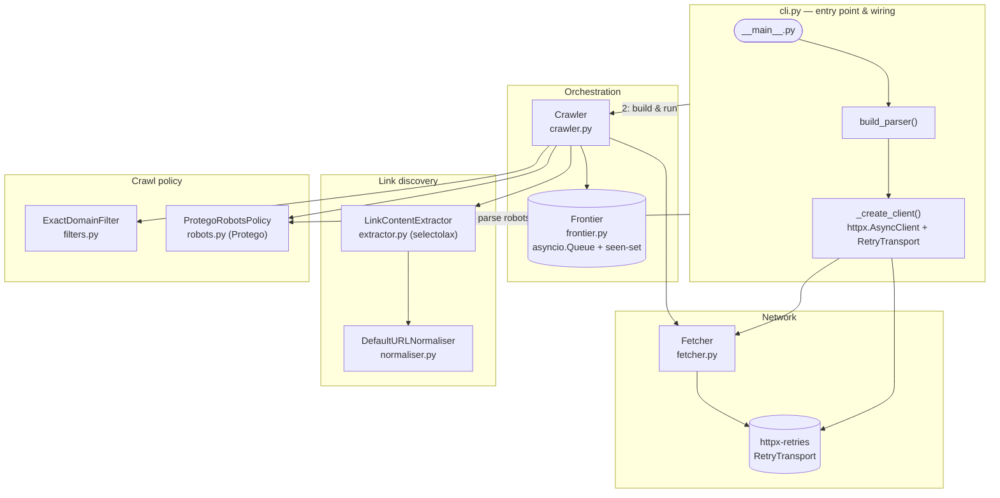

# python-developer-test

# Zego

## About Us

At Zego, we understand that traditional motor insurance holds good drivers back.
It's too complicated, too expensive, and it doesn't reflect how well you actually drive.
Since 2016, we have been on a mission to change that by offering the lowest priced insurance for good drivers.

From van drivers and gig economy workers to everyday car drivers, our customers are the driving force behind everything we do. We've sold tens of millions of policies and raised over $200 million in funding. And we’re only just getting started.

## Our Values

Zego is thoroughly committed to our values, which are the essence of our culture. Our values defined everything we do and how we do it.
They are the foundation of our company and the guiding principles for our employees. Our values are:

<table>
    <tr><td></td><td><b>Blaze a trail</b></td><td>Emphasize curiosity and creativity to disrupt the industry through experimentation and evolution.</td></tr>
    <tr><td></td><td><b>Drive to win</b></td><td>Strive for excellence by working smart, maintaining well-being, and fostering a safe, productive environment.</td></tr>
    <tr><td></td><td><b>Take the wheel</b></td><td>Encourage ownership and trust, empowering individuals to fulfil commitments and prioritize customers.</td></tr>
    <tr><td></td><td><b>Zego before ego</b></td><td>Promote unity by working as one team, celebrating diversity, and appreciating each individual's uniqueness.</td></tr>
</table>

## The Engineering Team

Zego puts technology first in its mission to define the future of the insurance industry.
By focusing on our customers' needs we're building the flexible and sustainable insurance products
and services that they deserve. And we do that by empowering a diverse, resourceful, and creative
team of engineers that thrive on challenge and innovation.

### How We Work

- **Collaboration & Knowledge Sharing** - Engineers at Zego work closely with cross-functional teams to gather requirements,
  deliver well-structured solutions, and contribute to code reviews to ensure high-quality output.
- **Problem Solving & Innovation** - We encourage analytical thinking and a proactive approach to tackling complex
  problems. Engineers are expected to contribute to discussions around optimization, scalability, and performance.
- **Continuous Learning & Growth** - At Zego, we provide engineers with abundant opportunities to learn, experiment and
  advance. We positively encourage the use of AI in our solutions as well as harnessing AI-powered tools to automate
  workflows, boost productivity and accelerate innovation. You'll have our full support to refine your skills, stay
  ahead of best practices and explore the latest technologies that drive our products and services forward.
- **Ownership & Accountability** - Our team members take ownership of their work, ensuring that solutions are reliable,
  scalable, and aligned with business needs. We trust our engineers to take initiative and drive meaningful progress.

## Who should be taking this test?

This test has been created for all levels of developer, Junior through to Staff Engineer and everyone in between.
Ideally you have hands-on experience developing Python solutions using Object Oriented Programming methodologies in a commercial setting. You have good problem-solving abilities, a passion for writing clean and generally produce efficient, maintainable scaleable code.

## The test 🧪

Create a Python app that can be run from the command line that will accept a base URL to crawl the site.
For each page it finds, the script will print the URL of the page and all the URLs it finds on that page.
The crawler will only process that single domain and not crawl URLs pointing to other domains or subdomains.
Please employ patterns that will allow your crawler to run as quickly as possible, making full use any
patterns that might boost the speed of the task, whilst not sacrificing accuracy and compute resources.
Do not use tools like Scrapy or Playwright. You may use libraries for other purposes such as making HTTP requests, parsing HTML and other similar tasks.

## The objective

This exercise is intended to allow you to demonstrate how you design software and write good quality code.
We will look at how you have structured your code and how you test it. We want to understand how you have gone about
solving this problem, what tools you used to become familiar with the subject matter and what tools you used to
produce the code and verify your work. Please include detailed information about your IDE, the use of any
interactive AI (such as Copilot) as well as any other AI tools that form part of your workflow.

You might also consider how you would extend your code to handle more complex scenarios, such a crawling
multiple domains at once, thinking about how a command line interface might not be best suited for this purpose
and what alternatives might be more suitable. Also, feel free to set the repo up as you would a production project.

Extend this README to include a detailed discussion about your design decisions, the options you considered and
the trade-offs you made during the development process, and aspects you might have addressed or refined if not constrained by time.

# Instructions

1. Create a repo.
2. Tackle the test.
3. Push the code back.
4. Add us (@nktori, @danyal-zego, @bogdangoie, @cypherlou, @marliechiller and @ZEGODiogoAlves) as collaborators and tag us to review.
5. Notify your TA so they can chase the reviewers.

# Technical discussion

An asynchronous web crawler that run under a CLI tool and, starting from a base URL, follows links within
that exact domain, and prints every page it visits and any the links found on it. For example:

```
$ crawler https://example.com
https://example.com/
  https://example.com/about
  https://example.com/contact
https://example.com/about
  https://example.com/
https://example.com/contact
```

Each block is a single `<page url>` followed by one indented line per link found on that page.

## Table of contents

- [Quick start](#quick-start)
- [CLI reference](#cli-reference)
- [How it works](#how-it-works)
- [Crawl process](#crawl-process)
- [Event model](#event-model)
- [Design decisions and trade-offs](#design-decisions-and-trade-offs)
- [Testing](#testing)
- [Tooling and AI-assisted workflow](#tooling-and-ai-assisted-workflow)
- [Known limitations and what I'd refine with more time](#known-limitations-and-what-id-refine-with-more-time)
- [Extending to multiple domains and beyond a CLI](#extending-to-multiple-domains-and-beyond-a-cli)

## Setting up

Requires Python 3.11+. Uses [`uv`](https://docs.astral.sh/uv/) to manage the dependencies, `uv.lock` is included to 
crate reproducible installations, but plain `pip` works too.

```bash
# with uv
uv sync
uv run crawler https://example.com

# or with pip, in a virtualenv
pip install -e .
crawler https://example.com
```

Running the test suite and static checks:

```bash
uv run pytest      # Tests are fully offline (HTTP responses are mocked, see Testing)
uv run mypy .      # strict mode
uv run ruff check .
```

## CLI reference

```
crawler <base_url> [options]
```

| Flag | Default           | Meaning |
|---|-------------------|---|
| `base_url` | —                 | Starting URL, e.g. `https://example.com` (must be an absolute `http(s)` URL) |
| `--concurrency` | `10`              | Number of concurrent worker tasks fetching pages |
| `--timeout` | `10.0`            | Per-request read/write/connect timeout, in seconds |
| `--max-retries` | `3`               | Retries for transient failures (timeouts, connection errors, `429`/`500`/`502`/`503`/`504`) |
| `--max-pages` | unlimited         | Optional cap on the total number of pages crawled |
| `--max-connections` | `10`              | Max concurrent connections in the underlying HTTP connection pool |
| `--max-keep-alive-connections` | `5`               | Keep-alive connections retained in that pool |
| `--user-agent` | `zegocrawler/0.1` | `User-Agent` sent with every request, and used to select the right `robots.txt` rules |
| `--log-level` | `WARNING`         | `DEBUG`/`INFO`/`WARNING`/`ERROR`/`CRITICAL`, written to stderr |

## How it works




The crawler is a small pipeline of several components, each with a single responsibility and defined against a
`typing.Protocol` and wired together only in the `cli.py` file:

- **`Crawler`** ([`crawler.py`](crawler/src/crawler.py)): It only deals with the orchestration of the pipeline. Runs several
  worker coroutines pulling the pending URLs from a shared `Frontier`, and for each one: checks the
  `RobotsPolicy`, fetches the content, extracts the links, writes the output, and re-queues any new domain links. It
  has no knowledge of HTTP, HTML parsing, or robots.txt syntax, all those are the responsability of other classes.
- **`Fetcher`** ([`fetcher.py`](crawler/src/fetcher.py)): wraps a single `httpx.AsyncClient`
  call to perform the HTTP requests. It honours a politeness delay (`min_delay`) extracted from the `robots.txt`, and turns the response (or a raised
  exception) into a `FetchResult`. Retries, exponential backoff, and `Retry-After` are delegated entirely to the client's `httpx-retries` transport
- **`Frontier`** ([`frontier.py`](crawler/src/frontier.py)): A simple `asyncio.Queue`and a 
  `seen` set. Allows the crawler to traverse links using breadth first traversal and deduplicate any links we already processed.
- **`LinkContentExtractor`** ([`extractor.py`](crawler/src/extractor.py)): parses the response HTML with
  `selectolax`, normalises every `href` attribute and drops duplicate or invalid links.
- **`DefaultURLNormaliser`** ([`normaliser.py`](crawler/src/normaliser.py)): Return the cannonical form of any URL: resolves it against the current page, strips fragments, 
  lower-cases the host, strips default ports, sorts query parameters, rejects non-`http(s)` schemes, etc.
- **`ExactDomainFilter`** ([`filters.py`](crawler/src/filters.py)): Checks a URL so that the hostname matches the seed's hostname, avoiding subdomains or parent domains.
- **`ProtegoRobotsPolicy`** ([`robots.py`](crawler/src/robots.py)): fetches and parses
  `robots.txt` via [Protego](https://github.com/scrapy/protego), exposes two functions `is_allowed()` and `crawl_delay`. Fails open (crawl everything, no delay)
  if the `robots.txt` is missing for any reason.

## Crawl process

The startup is sequential, we need to retrieve the `robots.txt` before fetching any page, once
`Crawler.run()` starts, we create several worker coroutunes (based on the `--concurrency` parameter), each of them pulls from the same `Frontier` instance
concurrently.

## Event model

From https://eventmodeling.org:

> Event Modeling is a method of describing systems using an example of how information has changed within them over time

The following diagram shows a single crawl as a left-to-right timeline of
**commands** , **events**, **read models** and **policies**. Everything downstream of `CrawlStarted` is the crawler reacting
to its own events. The crawler isn't literally event-sourced but, naming it's steps this way makes it easier to understand.

```mermaid
flowchart LR
    classDef trigger fill:#FF6B9D,color:#fff,stroke:#C9184A,stroke-width:1px;
    classDef command fill:#4C6EF5,color:#fff,stroke:#364FC7,stroke-width:1px;
    classDef event fill:#F59F00,color:#fff,stroke:#E67700,stroke-width:1px;
    classDef policy fill:#9775FA,color:#fff,stroke:#6741D9,stroke-width:1px,stroke-dasharray:4 2;
    classDef view fill:#12B886,color:#fff,stroke:#087F5B,stroke-width:1px;

    subgraph Legend["Legend"]
        direction LR
        L1(["Trigger"]):::trigger --> L2["Command"]:::command --> L3["Event"]:::event --> L4["Read Model"]:::view
        L5["Policy (automation)"]:::policy
    end

    subgraph S1["1. Start crawl"]
        direction TB
        T1(["User runs<br/>crawler &lt;base_url&gt;"]):::trigger --> C1["StartCrawl"]:::command --> E1["CrawlStarted"]:::event
    end

    subgraph S2["2. Load robots policy"]
        direction TB
        P2["on CrawlStarted"]:::policy --> C2["FetchRobotsTxt"]:::command --> E2["RobotsTxtFetched<br/>(fails open if unreachable)"]:::event --> V2["RobotsPolicy<br/>{is_allowed, crawl_delay}"]:::view
    end

    subgraph S3["3. Seed frontier"]
        direction TB
        P3["on RobotsTxtFetched"]:::policy --> C3["EnqueueUrl(seed)"]:::command --> E3["UrlEnqueued"]:::event --> V3["FrontierState<br/>{queued, seen}"]:::view
    end

    subgraph S4["4. Dequeue &amp; guard"]
        direction TB
        P4["worker idle,<br/>queue non-empty"]:::policy --> C4["DequeueUrl"]:::command --> E4["UrlDequeued"]:::event
        E4 --> D4a{"pages_crawled ≥<br/>max_pages?"}
        D4a -- yes --> E4a["PageCapReached<br/>(skip)"]:::event
        D4a -- no --> D4b{"robots allows<br/>this URL?"}
        D4b -- no --> E4b["PageDisallowedByRobots<br/>(skip)"]:::event
        D4b -- yes --> E4c["PageAllowed"]:::event
    end

    subgraph S5["5. Fetch page"]
        direction TB
        C5["FetchPage(url)<br/>sleep(min_delay) → GET<br/>(retries via RetryTransport)"]:::command --> D5{"result.html?"}
        D5 -- none --> E5a["PageFetchFailed"]:::event
        D5 -- html --> E5b["PageFetchSucceeded"]:::event
    end

    subgraph S6["6. Extract &amp; emit"]
        direction TB
        C6a["ExtractLinks(html)"]:::command --> E6a["LinksExtracted"]:::event --> C6b["WriteOutput(url, links)"]:::command --> E6b["PageCrawled"]:::event
        E6b --> V6a["CrawlStats<br/>{pages_crawled++}"]:::view
        E6b --> V6b["Stdout<br/>{url, links}"]:::view
    end

    subgraph S7["7. Filter &amp; enqueue links"]
        direction TB
        P7["on LinksExtracted,<br/>for each link"]:::policy --> C7["FilterLink(link)"]:::command --> D7{"same hostname<br/>as seed?"}
        D7 -- yes --> E7a["LinkAccepted"]:::event --> C7b["EnqueueUrl(link)"]:::command --> E7c["UrlEnqueued"]:::event
        D7 -- no --> E7b["LinkRejected"]:::event
    end

    subgraph S8["8. Complete crawl"]
        direction TB
        P8["frontier empty &amp;<br/>all tasks done"]:::policy --> C8["JoinFrontier"]:::command --> E8["CrawlCompleted"]:::event --> V8["CrawlStats (final)<br/>{pages_crawled, errors,<br/>robots_disallowed}"]:::view
    end

    E1 --> P2
    E2 --> P3
    E3 --> P4
    E4c --> C5
    E4a -. "next iteration" .-> P4
    E4b --> V4["CrawlStats<br/>{robots_disallowed++}"]:::view
    V4 -. "next iteration" .-> P4
    E5a --> V5["CrawlStats<br/>{errors++}"]:::view
    V5 -. "next iteration" .-> P4
    E5b --> C6a
    E6a --> P7
    V6a -. "next iteration" .-> P4
    E7a --> C7b
    E7c --> V3
    E7c -. "wakes any idle worker" .-> P4
    V3 -. "empty + idle → done" .-> P8
```




## Design decisions and trade-offs

- **Use of async primitives for crawling**. Crawling is IO bound as almost all tge execution
time is spent waiting on the network. A single event loop running several workers
 against a shared `httpx.AsyncClient` gets the concurrency benefit of threads
without their overhead. `httpx.AsyncClient` also keeps a persistent connection pool per host, so any
requests to the same domain will reuse the TCP/TLS connections instead of paying the handshake cost per
request. We realy on `asyncio` and `httpx`.
- **`selectolax` over `BeautifulSoup`.** HTML parsing is the other big cost in the crawler but,
in this case it's CPU-bound (it blocks the event loop and delays every other
in-flight worker). `selectolax` wraps a fast C parser (Modest or Lexbor) and is measurably
faster than `bs4`'s pure-Python tree for our simple simple `a[href]` selector. The overall 
throughput is high enough that it doesn't need a separate thread pool for parsing.
- **Protocol-based dependency injection everywhere.** `URLNormaliser`, `ContentExtractor`,
`DomainFilter`, and `RobotsPolicy` are all `typing.Protocol`s, not base classes.
`Crawler`/`Fetcher` depends only on those shapes and not on concrete implementations. The
trade-off that we are making versus ABCs is that we lose an explicit "this class implements that interface"
in exchange for looser coupling. The tests replace plain classes or `unittest.mock.Mock`
objects without much ceremony, and the test suite never makes a real HTTP request
(see [Testing](#testing)).
- **URL normalisation before dedup.** We want to avoid crawling the same resources repeatedly, 
`DefaultURLNormaliser` resolves, strips fragments, lower-cases the host, strips
default ports, and sorts query parameters so equivalent URLs will ahve the same canonical form
and thus can be easily deduped by the `Frontier`'s dedup set.
- **Retry policy: delegated to `httpx-retries`, instead of doing my own.** The first working version
of `Fetcher` implemented its own exponential backoff with jitter. On review,
it didn't made much sense to keep my own implementation so I replaced it with  
`httpx-retries`.
- **robots.txt compliance**
It wasn't strictly required by the instructions but, it's a minimum expectation 
for any crawler that might run against a real site. It was pretty easy to add given `Protego`
already exitst as a well-tested library for it.
- **Enfoce the politeness delay from `robots.txt`'s `Crawl-delay`.**
The crawler fetches and parses `robots.txt`
*before* any page is crawled and uses its `Crawl-delay` directive (if present) as a fixed 
delay per request.
**`--max-pages` as a safety limit.** There are sites that will create "Crawler traps" 
(infinite pagination, session-ID-in-URL loops that dodge the normaliser, etc.). This also wasn't strictly 
required but was added as a safety limit. See [Known limitations](#known-limitations-and-what-id-refine-with-more-time) for a caveat about
its behavior under concurrency.

## Testing

77 tests across 7 files, run with `pytest` and `pytest-asyncio`, running completely offline:
[`respx`](https://lundberg.github.io/respx/) intercepts HTTP calls at the transport level, so no
test ever makes a real network call.

Each module is tested in isolation using `Protocol` like fakes or mocks for its
dependencies (e.g. `crawler/tests/test_crawler.py` uses custom `AllowAllRobotsPolicy`
/ `DisallowRobotsPolicy` doubles rather than the real Protego-backed implementation).

`mypy --strict` and `ruff` were setup as well.

## Tooling and AI-assisted workflow

- **Editor:** Pycharm 2026.1.4 running on Windows 11 (I know) and Python 3.14.
- **AI usage:** I used Claude on an iterative session, across several small review rather than one large autonomous session. 
  Specifically Claude generated: 
  - Implemented the `normaliser` based on a set of tests I created as requirements.
  - The Retry and backoff logic. It went through three iterations, each reviewed and redirected, with tests 
  rewritten each time to match the code requirements: 
    - hand-rolled backoff
    - hand-rolled backoff plus an adaptive throttle 
    - replaced entirely by `httpx-retries` once that dependency was added
  - Running `ruff` / `mypy --strict` / `pytest` after every change as the acceptance loop and
    fixing what they flagged.
  - The main loop on the `crawler.py` to avoid mistakes with coroutines. 
- **Dependency management:** [`uv`](https://docs.astral.sh/uv/), with `uv.lock` and `hatchling` as the build backend.
- **Static analysis:** `ruff`and `mypy --strict` (full static
  typing, used `from __future__ import annotations` throughout the codebase).

## Known limitations and what I'd refine with more time

- **`--max-pages` has a race condition under concurrency.** `Crawler._process` reads
  `self._stats.pages_crawled` and compares it to `max_pages` *before* the `await` on
  `Fetcher.fetch()`, with no lock. Multiple workers can pass that check simultaneously before
  any of them increments the counter, so the crawl can overshoot the cap. The best solution would be to ise a lock, or an `asyncio.Semaphore`.
- **No persistence or resume.** The Frontier and dedup state live only in memory. Once the crawler finishes it loses all progress 
  and we have to start over from the base URL. I would have liked to use Redis (and a bloom filter for deduping) to store the visited URLs 
  along with metadata about them like last time crawled, e-tag, last modified, size, links extracted from it.
- **No support for e-tags or Last-Modified.** if we already crawled a page and it hasn't change since then we
  could skip it.
- **No conditional requests: `ETag`/`Last-Modified` are ignored.**  Along with the previous one, if we had some form of persistence we could avoid
 having every to fetch every page again. The crawler never sends `If-None-Match`/`If-Modified-Since` or handles a `304` return code, so
  recrawling a site always needs to download and parsesevery page in full, even if nothing
  changed since the last visit. 
- **Everything runs as one asyncio event loop in one process.** There's no distributed task
  execution to run part of the process on different machines. Celery or 
  `arq` could be good choices.
- **Downloaded pages aren't kept.** The `Fetcher` parses each response for links and then
  discards it. We don't have a need for it but if any other process downstream of the crawler needed the raw HTML 
  they would have to fetch it again.
- **We need to download the full response body before doing any parsing.** `Fetcher` calls
  `client.get(url)`, which buffers the entire response into memory (`response.text`) before
  `LinkContentExtractor` ever sees it. There's no streaming/size-capped read. A page that returns an extremely large (or effectively
  infinite) HTML body would be read into memory in full and could exhaust it. One possible fix would be to stream the response and aborting once a 
  configurable ceiling is exceeded.
- **No `sitemap.xml` discovery.** Real crawlers typically use to find
  pages that aren't reachable purely by following `<a>` tags.
- **No JavaScript rendering.** The instructions said to **not** use Playwright but its worth mentioning that any content 
  injected from the client side is invisible to this   crawler.
- **`robots.txt` is fetched once per crawl.** If the crawler runs for long enough its possible that the content of the file could have changed.

## Extending to multiple domains and beyond a CLI

A CLI is a good fit for the brief of this exercise but once the requirement becomes "crawl many
domains, on an ongoing basis, and let other people see the results" is not a good fit.

- **The state lives only in the invoking process.** The frontier, dedup set, and results all
  disappear if the process is killed or the terminal closes. There's no way to inspect
  progress, pause, resume, or cancel a long crawl from outside that one process.
- **One crawl per invocation, tied to one event loop.** Running many domains at once
  means running many separate `crawler` processes yourself and manually managing their
  concurrency and resource usage against each other. There's no shared view of how many crawls
  are running, how far along is each one.
- **Politeness is a single limit per process.** `min_delay` is enforced by a single `Fetcher` instance, if
  two independent processes both decided to crawl the same domain, neither would know about
  the other and their combined request rate could violate the site's `Crawl-delay` even
  though each individually respects it.

Given all the time in the world, I'd evolve this into a small service using a Task framework like Celery or `arq`.
The `Crawler`/`Fetcher`/`Frontier` core is already a plain library with almost no CLI coupling. As a 
non-exhaustive list of components I'll add: 

1. **A job API** (e.g. FastAPI) exposing `POST /crawls {domain, options}`,
   `GET /crawls/{id}` (status and partial results), `DELETE /crawls/{id}` (for cancel a crawl). The job
   metadata and status persisted in a database (Postgres for eg) rather than in memory.
2. **A distributed task queue** (Celery, `arq`, or something with durable retries like
   Temporal) so domains genuinely crawl in parallel across processes and machines.
3. **A shared, persistent `Frontier` and dedup store.** For example a Redis `SET` (or a bloom filter at
   very large scale) per crawl ID.
4. **Centralized, per-host rate limiting.** A Redis token bucket keyed by hostname so the *combined* request 
   rate across every worker respects each site's `Crawl-delay`, not just each worker individually.
5. **Results to durable storage.** We could use object storage (S3) or a
   message topic (Kafka/SQS) for downstream consumers.
6. **Observability**: the codebase already uses structured `logging`; I would add metrics
   (pages/sec, error rate, queue depth per job) and tracing, plus a minimal dashboard over
   the job API.
