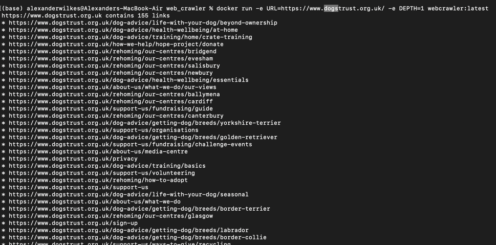

# python-developer-test

# Zego

## About Us

At Zego, we understand that traditional motor insurance holds good drivers back.
It's too complicated, too expensive, and it doesn't reflect how well you actually drive.
Since 2016, we have been on a mission to change that by offering the lowest priced insurance for good drivers.

From van drivers and gig economy workers to everyday car drivers, our customers are the driving force behind everything we do. We've sold tens of millions of policies and raised over $200 million in funding. And we’re only just getting started.

## Our Values

Zego is thoroughly committed to our values, which are the essence of our culture. Our values defined everything we do and how we do it.
They are the foundation of our company and the guiding principles for our employees. Our values are:

<table>
    <tr><td></td><td><b>Blaze a trail</b></td><td>Emphasize curiosity and creativity to disrupt the industry through experimentation and evolution.</td></tr>
    <tr><td></td><td><b>Drive to win</b></td><td>Strive for excellence by working smart, maintaining well-being, and fostering a safe, productive environment.</td></tr>
    <tr><td></td><td><b>Take the wheel</b></td><td>Encourage ownership and trust, empowering individuals to fulfil commitments and prioritize customers.</td></tr>
    <tr><td></td><td><b>Zego before ego</b></td><td>Promote unity by working as one team, celebrating diversity, and appreciating each individual's uniqueness.</td></tr>
</table>

## The Engineering Team

Zego puts technology first in its mission to define the future of the insurance industry.
By focusing on our customers' needs we're building the flexible and sustainable insurance products
and services that they deserve. And we do that by empowering a diverse, resourceful, and creative
team of engineers that thrive on challenge and innovation.

### How We Work

- **Collaboration & Knowledge Sharing** - Engineers at Zego work closely with cross-functional teams to gather requirements,
  deliver well-structured solutions, and contribute to code reviews to ensure high-quality output.
- **Problem Solving & Innovation** - We encourage analytical thinking and a proactive approach to tackling complex
  problems. Engineers are expected to contribute to discussions around optimization, scalability, and performance.
- **Continuous Learning & Growth** - At Zego, we provide engineers with abundant opportunities to learn, experiment and
  advance. We positively encourage the use of AI in our solutions as well as harnessing AI-powered tools to automate
  workflows, boost productivity and accelerate innovation. You'll have our full support to refine your skills, stay
  ahead of best practices and explore the latest technologies that drive our products and services forward.
- **Ownership & Accountability** - Our team members take ownership of their work, ensuring that solutions are reliable,
  scalable, and aligned with business needs. We trust our engineers to take initiative and drive meaningful progress.

## Who should be taking this test?

This test has been created for all levels of developer, Junior through to Staff Engineer and everyone in between.
Ideally you have hands-on experience developing Python solutions using Object Oriented Programming methodologies in a commercial setting. You have good problem-solving abilities, a passion for writing clean and generally produce efficient, maintainable scaleable code.

## The test 🧪

Create a Python app that can be run from the command line that will accept a base URL to crawl the site.
For each page it finds, the script will print the URL of the page and all the URLs it finds on that page.
The crawler will only process that single domain and not crawl URLs pointing to other domains or subdomains.
Please employ patterns that will allow your crawler to run as quickly as possible, making full use any
patterns that might boost the speed of the task, whilst not sacrificing accuracy and compute resources.
Do not use tools like Scrapy or Playwright. You may use libraries for other purposes such as making HTTP requests, parsing HTML and other similar tasks.

## The objective

This exercise is intended to allow you to demonstrate how you design software and write good quality code.
We will look at how you have structured your code and how you test it. We want to understand how you have gone about
solving this problem, what tools you used to become familiar with the subject matter and what tools you used to
produce the code and verify your work. Please include detailed information about your IDE, the use of any
interactive AI (such as Copilot) as well as any other AI tools that form part of your workflow.

You might also consider how you would extend your code to handle more complex scenarios, such a crawling
multiple domains at once, thinking about how a command line interface might not be best suited for this purpose
and what alternatives might be more suitable. Also, feel free to set the repo up as you would a production project.

Extend this README to include a detailed discussion about your design decisions, the options you considered and
the trade-offs you made during the development process, and aspects you might have addressed or refined if not constrained by time.

# Instructions

1. Create a repo.
2. Tackle the test.
3. Push the code back.
4. Add us (@2014klee, @danyal-zego, @bogdangoie, @cypherlou and @marliechiller) as collaborators and tag us to review.
5. Notify your TA so they can chase the reviewers.

# Screenshot

# Information about tooling
## IDE and use of AI
I use PyCharm as my IDE. This has an AI code completion built in. I do not heavily rely on this but occasionally accept
suggestions.
I more heavily use the AI for test generation. This is primarily generating test data. This involves using prompts like
'Generate a set of linked webpages that can be used as the basis for an integration test for the WebCrawler class.'
Whilst writing some of my tests, I have used the AI to write the tests themselves, e.g. with prompts like 'Write unit
tests for the make_absolute method of URL class.'  I do not blindly accept AI generated code, but find it generally excellent
at unit testing.

# Usage
## Running locally
Install requirements:
```
pip install -r requirements.txt
pip install -e ./
```
or
```
make requirements
```

Run the crawler:
```
python web_crawler/crawl.py --url https://zego.com --depth 2
```
This command will crawl the passed URL and print the results. The depth parameter controls how many links the crawler
will follow from the starting page before terminating.

## Docker container
For convenience, a Docker container is provided which can also run the crawler. Build the container:
```
docker build -t webcrawler .
```
or
```
make docker-build
```
And run the container with arguments as follows:
```
docker run -e URL=https://www.dogstrust.org.uk/ -e DEPTH=1 webcrawler
```
# Solution approach
### Single-threaded option
* The STWebCrawler class takes a start URL, finds all the links on that page and then recursively repeats this process until a maximum depth has been reached (or no further links can be followed).
* Complexity around URLs is encapsulated in the URL class.
* This STWebCrawler class is instantiated and demonstrated in the `crawl.py` script.

### Multi-threaded option
* A single threaded option is presented as my 'main' solution (see STWebcrawler).
* I wanted to explore a more scalable, parallelised approach.
* I used the threading library to achieve this, maintaining a common queue that each library can pull from and submit newly found links to
* There is an open issue around knowing when to terminate threads I've discussed further in that code
* The single threaded approach is the main approach I've developed and tested, code in the multi-threaded approach is less optimised and tested
* The multi-threaded approach can be used by passing `--multi-threaded` to `crawl.py`

# Design Considerations
### Complexity of URLS
* URLs can be absolute or relative. Relative URLs are relative to the page they link from so we have to resolve these in
order to crawl effectively. This is done in the URL class with urllib.
* URLs can be to specific locations within a page using the fragment pattern e.g. `http://a.com/link.html#about`. The fragment component is not of use and is discarded within the URL class.
* URLs can have optional trailing slashes which point to the same resource, e.g. `/products/` and `/products`. This is handled within the URL class.
* Some URLs are to none web resources e.g. `mailto:`
* Some URLs are to javascript functions e.g. `<a href="javascript:doSomething();">`
* URLs can contain query parameters, e.g. `year=2025`. I have interpreted the same page with different query parameters to represent distinct pages.

### Subdomains
* The requirement is for the crawler to only crawl within the same subdomain.
* I've interpreted this to mean www.amazon.com is different than amazon.com.
* Although there is a convention that `www.` points to the same resources as no subdomain, this will occasionally not be followed so they are treated separately

### Link cycles
* It's quite normal for webpages to cyclically link to each other
* e.g. A -> B, B -> C, C -> A
* We therefore maintain a list of crawled links in the crawler and don't revisit pages we've already crawled

### Termination
* The class must be run with a max_depth, this indicates how many links will be followed before the script terminates
* I intended to make this parameter optional and allow any depth to be searched but have not had time to implement this

### Dynamic content
* Sometimes pages contain dynamic content that will be loaded after initial load which could contain more links. This is not handled by this project.

### Anti-scraping
* Most websites will block repeated requests from scrapers or perceived DoS attacks.
* This project does not yet handle this.
* A further development of this project would look for ways to mitigate this
  * e.g. by deliberately slowing requests
  * including realistic browser headers in the request

### Handling non-200 status codes
* HTTP allows for a number of status codes that could influence scraping behaviour
* e.g. 302 indicates redirection, which the scraper should ideally follow
* 503 indicates the server is currently unavailable, which ideally means the scraper should retry later
* I have not generally handled these scenarios and others, instead HTTP errors are effectively suppressed. This is purely due to lack of time.

# Tests
* Code is unit tested in python/web_crawler/tests
* Integration tests also exist in this
* These can be run with `make test` or `pytest web_crawler/tests'

# Rejected approaches
### Graph approach
* I tried constructing a networkx graph of the site structure as the site was crawled in order to know whether sites were already crawled or not but realised this was unnecessary and likely to be less performant than a simple map
### Multiprocessing
* I considered trying to use multiple processes to parallelise the task. This required creating a shared state of the already crawled sites accessible by all processes and was abandoned in favour of multithreading.

# Proposed Future improvements
### Scaling
* Further work investing in the multithreaded approach to tune and address termination
* A distributed system could be built using multiple worker nodes to scrape pages being orchestrated by a manager node that maintains the state of which pages have been scraped and the queue of outstanding scraping tasks. This would likely involve creating a messaging system for communicating between the orchestrator and worker nodes.

### Robustness
* Much more work is required to correctly handle different HTTP errors correctly

### Completeness
* The use of the python requests library means javascript is not being executed and dynamic content isn't loaded
* Use of a headless browser could solve this