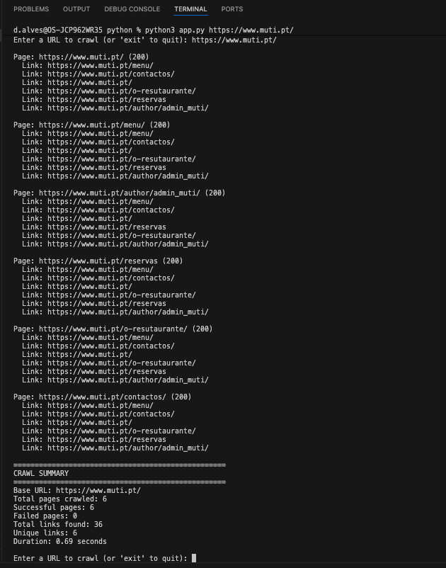
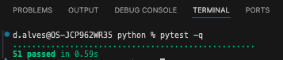

# python-developer-test

# Zego

## About Us

At Zego, we understand that traditional motor insurance holds good drivers back.
It's too complicated, too expensive, and it doesn't reflect how well you actually drive.
Since 2016, we have been on a mission to change that by offering the lowest priced insurance for good drivers.

From van drivers and gig economy workers to everyday car drivers, our customers are the driving force behind everything we do. We've sold tens of millions of policies and raised over $200 million in funding. And we’re only just getting started.

## Our Values

Zego is thoroughly committed to our values, which are the essence of our culture. Our values defined everything we do and how we do it.
They are the foundation of our company and the guiding principles for our employees. Our values are:

<table>
    <tr><td></td><td><b>Blaze a trail</b></td><td>Emphasize curiosity and creativity to disrupt the industry through experimentation and evolution.</td></tr>
    <tr><td></td><td><b>Drive to win</b></td><td>Strive for excellence by working smart, maintaining well-being, and fostering a safe, productive environment.</td></tr>
    <tr><td></td><td><b>Take the wheel</b></td><td>Encourage ownership and trust, empowering individuals to fulfil commitments and prioritize customers.</td></tr>
    <tr><td></td><td><b>Zego before ego</b></td><td>Promote unity by working as one team, celebrating diversity, and appreciating each individual's uniqueness.</td></tr>
</table>

## The Engineering Team

Zego puts technology first in its mission to define the future of the insurance industry.
By focusing on our customers' needs we're building the flexible and sustainable insurance products
and services that they deserve. And we do that by empowering a diverse, resourceful, and creative
team of engineers that thrive on challenge and innovation.

### How We Work

- **Collaboration & Knowledge Sharing** - Engineers at Zego work closely with cross-functional teams to gather requirements,
  deliver well-structured solutions, and contribute to code reviews to ensure high-quality output.
- **Problem Solving & Innovation** - We encourage analytical thinking and a proactive approach to tackling complex
  problems. Engineers are expected to contribute to discussions around optimization, scalability, and performance.
- **Continuous Learning & Growth** - At Zego, we provide engineers with abundant opportunities to learn, experiment and
  advance. We positively encourage the use of AI in our solutions as well as harnessing AI-powered tools to automate
  workflows, boost productivity and accelerate innovation. You'll have our full support to refine your skills, stay
  ahead of best practices and explore the latest technologies that drive our products and services forward.
- **Ownership & Accountability** - Our team members take ownership of their work, ensuring that solutions are reliable,
  scalable, and aligned with business needs. We trust our engineers to take initiative and drive meaningful progress.

## Who should be taking this test?

This test has been created for all levels of developer, Junior through to Staff Engineer and everyone in between.
Ideally you have hands-on experience developing Python solutions using Object Oriented Programming methodologies in a commercial setting. You have good problem-solving abilities, a passion for writing clean and generally produce efficient, maintainable scaleable code.

## The test 🧪

Create a Python app that can be run from the command line that will accept a base URL to crawl the site.
For each page it finds, the script will print the URL of the page and all the URLs it finds on that page.
The crawler will only process that single domain and not crawl URLs pointing to other domains or subdomains.
Please employ patterns that will allow your crawler to run as quickly as possible, making full use any
patterns that might boost the speed of the task, whilst not sacrificing accuracy and compute resources.
Do not use tools like Scrapy or Playwright. You may use libraries for other purposes such as making HTTP requests, parsing HTML and other similar tasks.

## The objective

This exercise is intended to allow you to demonstrate how you design software and write good quality code.
We will look at how you have structured your code and how you test it. We want to understand how you have gone about
solving this problem, what tools you used to become familiar with the subject matter and what tools you used to
produce the code and verify your work. Please include detailed information about your IDE, the use of any
interactive AI (such as Copilot) as well as any other AI tools that form part of your workflow.

You might also consider how you would extend your code to handle more complex scenarios, such a crawling
multiple domains at once, thinking about how a command line interface might not be best suited for this purpose
and what alternatives might be more suitable. Also, feel free to set the repo up as you would a production project.

Extend this README to include a detailed discussion about your design decisions, the options you considered and
the trade-offs you made during the development process, and aspects you might have addressed or refined if not constrained by time.

# Instructions

1. Create a repo.
2. Tackle the test.
3. Push the code back.
4. Add us (@2014klee, @danyal-zego, @bogdangoie, @cypherlou and @marliechiller) as collaborators and tag us to review.
5. Notify your TA so they can chase the reviewers.

---

# Crawler

Small CLI tool to extract all links from a webpage.

## Requirements

- Python 3.9+ (3.11 recommended)
- Docker (optional, if you want to run inside a container)

## Install and run locally (Option 1)

1. Clone repository

```bash
git clone <repo-url>
cd python
```

2. Install dependencies

```bash
pip install -r requirements.txt
```
or 

```bash
python3 -m pip install -r requirements.txt
```

3. Run project

```bash
python app.py https://www.muti.pt/
```
or
```bash
python3 app.py https://www.muti.pt/
```


4. Run tests

```bash
pytest -q
```



## Run inside a virtual environment (Option 2)

```bash
cd python
python3 -m venv venv
source venv/bin/activate # macOS/linux - used command during dev
.\venv\Scripts\Activate.ps1 # windows powershell
.\venv\Scripts\activate.bat # windows cmd
python -m pip install -r requirements.txt
python app.py https://www.muti.pt/
pytest -v
deactivate

```

## Run inside a container (Option 3)
By running these commands you wil only be able to run the job only for one URL.

1. Build docker image (ensure your docker daemon is running before)

```bash
cd python
docker build -t crawler:latest .
```

2. Run the container

```bash
docker run --rm crawler:latest https://www.muti.pt/
```

---

## Testing
1. Run the tests
```bash
cd python
pytest -q
```

2. Debug the tests on VSCode
*Install Python extension
*Open Command Palette: Ctrl+Shift+P (Windows/Linux) or Cmd+Shift+P (macOS)
*Type: Python: Configure Tests
*Select pytest
*Choose your tests folder (e.g., test/)
*VS Code will detect tests automatically.
*Set breakpoints
*Debug Test

---

## **1. High-Level Design Decisions**
**Async I/O (`asyncio` + `httpx`)**: allows concurrent fetching of multiple pages without creating excessive threads, minimal context-switch overhead. Crawling is I/O-bound.

**Caching Strategy**: Implemented in-memory cache since its Fast, minimal memory overhead, avoids repeated requests.
* **Cons:** Lost when process exits; cannot resume previous runs.
* Could be improved with persistent caching if long-term caching were needed.

**HTML Parsing**: Used BeautifulSoup(html, "lxml") insted of python html.parse, since it's Faster and more robust than the default parser for large or malformed HTML.
**Cons:** Requires installing `lxml`, which adds a dependency.

**Concurrency Control**: Used Semaphore-controlled concurrency (limit number of simultaneous requests) vs Unlimited concurrent async requests.
* Prevents overwhelming target servers.
* Allows user to configure concurrency via CLI.

**Trade-offs:**
* Too low concurrency → slower crawl.
* Too high → risk of network overload or being blocked by server.

---

## **2. Potential Improvements if Not Constrained by Time**

1. **Persistent Cache**: Using `sqlite` or `diskcache` for multi-run caching.
2. **Depth Control**: Limit crawl depth to avoid infinitely nested pages.
3. **Retry & Backoff**: Retry failed requests with exponential backoff for transient network issues.
4. **Logging & Metrics**
5. **Streaming Parser**: For huge pages, parse HTML without loading full page in memory.
6. **Integration Testing of Full Crawl**: Simulate multiple interconnected pages in tests to validate recursive crawling.

---
