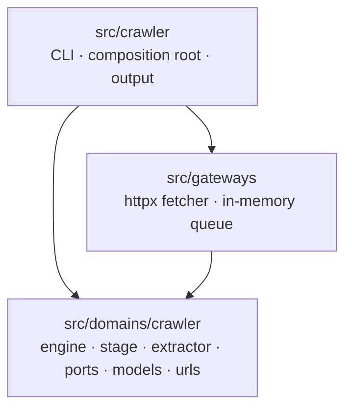
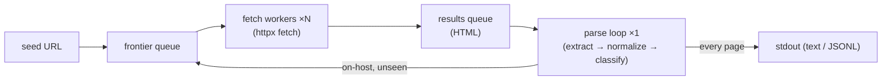

# crawler

A single-domain web crawler exposed as a `crawler` command-line tool. Given a
starting URL it visits every page **within that domain**, printing each page and
the links found on it. Links to other domains — and to subdomains — are listed
but never followed.

## Requirements

- Python 3.13+
- [uv](https://docs.astral.sh/uv/) for environment and dependency management

## Quickstart

```bash
# Install dependencies into a local .venv
make install

# Run the test/lint/type-check gate
make check

# Invoke the CLI
make run ARGS="--help"
```

## Usage

```bash
crawler crawl URL [OPTIONS]
```

Crawl `URL` within its own domain and print each discovered page with the links
on it.

| Option | Default | Meaning |
| --- | --- | --- |
| `--concurrency N` | `10` | Number of concurrent fetch workers. |
| `--timeout SECONDS` | `10.0` | Per-request timeout. |
| `--max-pages N` | unlimited | Stop after crawling `N` pages. |
| `--json` | off | Emit one JSON object per page (JSONL) instead of text. |

Examples:

```bash
# Human-readable: each page URL, then its links indented beneath it
make run ARGS="crawl https://example.com"

# Cap the crawl and stream JSONL (one compact object per line) for piping
make run ARGS="crawl https://example.com --json --max-pages 50"

# Turn up concurrency for a larger site
make run ARGS="crawl https://example.com --concurrency 25"
```

**Output.** In text mode each page prints its URL on one line with every link
indented two spaces beneath; a page that failed prints as
`URL  [error: message]`. In `--json` mode each page is one compact JSON object
with `url`, `links`, `status`, and `error` keys. Page results stream to **stdout**
as they are crawled; operational notices (e.g. a `--max-pages` truncation notice)
go to **stderr**, so piping stdout stays clean. A seed that is not an `http`/`https`
URL with a host exits with code `2`.

## Architecture & design

The crawler follows a Clean Architecture split across three layers, with all
dependencies pointing inward toward a pure domain core.


```mermaid
flowchart TD
    CLI["src/crawler<br/>CLI · composition root · output"]
    DOM["src/domains/crawler<br/>engine · stage · extractor · ports · models · urls"]
    GW["src/gateways<br/>httpx fetcher · in-memory queue"]
    CLI --> DOM
    GW --> DOM
    CLI --> GW
```

- **`src/domains/crawler`** — the inner core: the `engine` coordinator, the parse
  `stage`, the link `extractor`, the `ports` (Protocols), the frozen `models`, and
  URL logic. It performs no I/O — it uses selectolax purely for in-process HTML
  parsing, but makes no network or filesystem calls.
- **`src/gateways`** — outward adapters that implement the domain ports: an httpx
  fetcher and an in-memory queue.
- **`src/crawler`** — the CLI composition root: the Typer app, the `crawler_factory`
  wiring, and the text/JSONL output renderers.

The domain core depends on nothing outward; the CLI and gateways depend on the
domain's ports. A test (`tests/test_architecture.py`) AST-scans the domain and
fails the build if it ever imports an I/O or framework library (httpx, typer,
asyncer) or an outer layer (`crawler`, `gateways`), so the boundary cannot
silently rot. A pure parsing library (selectolax) is allowed: it does no I/O.

### Crawl pipeline

A fetch fan-out feeding a single parse loop, joined by two queues. N fetch workers
run concurrently (the workload is I/O-bound); one parse loop owns all shared
state, so no locks are needed.


```mermaid
flowchart LR
    seed["seed URL"] --> FR["frontier queue"]
    FR --> FW["fetch workers ×N<br/>(httpx fetch)"]
    FW --> RQ["results queue<br/>(HTML)"]
    RQ --> PL["parse loop ×1<br/>(extract → normalize → classify)"]
    PL -->|on-host, unseen| FR
    PL -->|every page| OUT["stdout (text / JSONL)"]
```

**Completion.** The coordinator tracks an in-flight counter — incremented when a
URL is enqueued, decremented after its HTML has been parsed. The crawl is done
when that counter reaches zero, *not* when the queues look empty (checking "queues
empty" would exit early while a worker is still mid-fetch). Once it hits zero
every worker is provably idle, blocked on `frontier.get()`, so shutdown is a
clean task cancellation — no sentinel values threading through the queues.

### Design decisions

- **asyncio over threads.** The work is almost entirely waiting on HTTP, the
  canonical fit for asyncio. One shared `httpx.AsyncClient` pools connections
  across the whole crawl.
- **N fetch workers, one parse loop.** asyncio is single-threaded, so parsing is
  serialized regardless of how it is structured. Making the parse loop the *only*
  writer of the `visited` set and the in-flight counter removes the need for any
  locking — the concurrency is confined to the fetch fan-out, where it actually
  helps.
- **Ports for external seams only.** The two genuine I/O boundaries — `Fetcher`
  (HTTP) and `Queue` (transport) — are `typing.Protocol`s defined in the domain,
  so the HTTP client and queue are each swappable and the engine is tested
  end-to-end with zero network using fakes. Link extraction is a pure in-domain
  transform used concretely, not behind a port — no interface is introduced until
  a second implementation exists. Wiring is a few lines in `crawler_factory`; an
  exercise this size does not need a DI framework.
- **selectolax + httpx.** Chosen for speed and a clean async API. httpx sits
  behind the `Fetcher` port (a different client is a one-file change); selectolax
  is used directly inside the parse stage as the link-extraction strategy.
- **Deliberate non-abstractions.** The `visited` set stays a plain `set` — it is
  single-writer and inseparable from the in-process completion logic, so a port
  around it would be ceremony. The bias throughout is toward minimal cognitive
  complexity over speculative generality.

### Trade-offs & future work

- **robots.txt is not implemented (future work).** There is no robots handling
  today. A production crawler must fetch, cache, and honor each origin's
  `/robots.txt` — Disallow rules and Crawl-delay, denying on parse failure —
  before running against third-party sites. This was deliberately left out rather
  than stubbed behind a guessed interface; the gate would be reintroduced (likely
  in the fetcher or a dedicated stage) when the real policy is built.
- **JS-rendered links are out of scope.** The brief forbids Scrapy and Playwright,
  so links injected by client-side JavaScript are not seen. This is a stated
  limitation, not an oversight.
- **`max_bytes` bounds stored body size, not transfer.** The full response is
  downloaded before the size is checked, so the cap limits the HTML retained in
  memory rather than bytes over the wire — a deliberate simplification.
- **URL credentials are dropped.** `user:pass@host` userinfo is stripped during
  normalization (from both the canonical URL and the host used for same-host
  matching). Fine for crawling; noted for completeness.
- **Distributed evolution.** The seams make a distributed version a swap rather
  than a rewrite: replace the in-memory `Queue` with Kafka/SQS, promote the
  `visited` set to a shared store (e.g. Redis `SADD`), and split fetch and parse
  into separate worker processes. At that point the in-flight counter relocates
  to a shared backend counter and **distributed termination becomes a genuinely
  harder problem** — a recursive frontier can no longer be awaited as a fixed task
  group. A CLI is also the wrong long-term interface for large-scale or
  multi-domain crawling; a queue-driven service reusing the same domain core is
  the direction.

### Tooling & AI usage

This exercise was developed with the Claude Code CLI in an IDE, following a
brainstorm → spec → plan → TDD-implementation workflow. The design spec and the
step-by-step implementation plan live under `docs/superpowers/`.

## Project layout

```
python/
├── src/
│   ├── crawler/                 # CLI / composition root (outer layer)
│   │   ├── cli.py               # Typer app; the `crawl` command
│   │   ├── factory.py           # wires the fetcher + queues into a Crawler
│   │   ├── presenters.py        # PageResult → text / JSONL
│   │   └── __main__.py          # enables `python -m crawler`
│   ├── domains/crawler/         # domain core (no I/O)
│   │   ├── engine.py            # the async crawl coordinator
│   │   ├── stages/              # parse stage (extract → normalize → classify)
│   │   ├── extractor.py         # selectolax link extractor
│   │   ├── ports.py             # Protocols: Fetcher, Queue
│   │   ├── models.py            # frozen dataclasses
│   │   └── urls.py              # normalize / extract_host / same_host
│   └── gateways/                # adapters (outer layer)
│       ├── http/                # httpx fetcher
│       └── queue/               # in-memory asyncio.Queue adapter
├── tests/                       # pytest suite (outside the package)
└── pyproject.toml               # project metadata, deps, and tool config
```

## Design notes

- **`src/` layout** keeps imports honest: tests run against the installed
  package, not loose modules on `sys.path`.
- **Typer** gives a typed CLI with minimal boilerplate; the function signature
  *is* the command schema.
- **`asyncer.runnify`** bridges Typer's sync command callback to the async crawler
  core without scattering `asyncio.run` calls.
