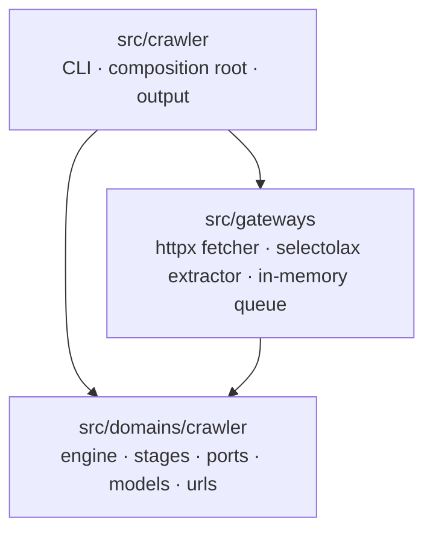
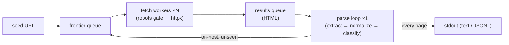

# Single-Domain Web Crawler Implementation Plan

> **For agentic workers:** REQUIRED SUB-SKILL: Use superpowers:subagent-driven-development (recommended) or superpowers:executing-plans to implement this plan task-by-task. Steps use checkbox (`- [ ]`) syntax for tracking.

**Goal:** Implement the `crawler crawl URL` command — an async, single-domain web crawler that prints every page it finds and the links on it, following only same-host links.

**Architecture:** Clean Architecture in three layers. `src/domains/crawler` is the pure inner core (engine + ports + models + URL logic, stdlib only). `src/gateways` holds outward adapters (httpx fetcher, selectolax link extractor, in-memory queue). `src/crawler` is the CLI composition root that wires them and formats output. Concurrency: N async fetch workers + a single parse loop, joined by two queues; a coordinator-owned `visited` set and `in_flight` counter detect completion.

**Tech Stack:** Python 3.13, asyncio, httpx, selectolax, Typer + asyncer (existing), pytest + pytest-asyncio (existing, `asyncio_mode=auto`), pytest-httpx, ruff, ty, uv.

**Spec:** `docs/superpowers/specs/2026-05-31-crawler-design.md` (read it before starting).

**Conventions for every task:**
- Run commands from the `python/` directory.
- Run a single test with `uv run pytest <path>::<name> -v`.
- After each task, `make check` must still pass (format-check, lint, typecheck, test) before the final commit of that task; if formatting drifts, run `make fix`.
- The domain layer (`src/domains/`) must import **only** stdlib + typing — never `httpx`, `selectolax`, `typer`, or anything under `src/gateways` or `src/crawler`. This is the architectural invariant; a task at the end enforces it with a test.

---

## File structure (created by this plan)

```
src/
  domains/
    __init__.py                         # namespace marker (empty)
    crawler/
      __init__.py                       # public surface re-exports
      models.py                         # frozen dataclasses (no I/O)
      urls.py                           # pure URL functions (stdlib urllib only)
      ports.py                          # Protocols: Fetcher, LinkExtractor, Queue, RobotsPolicy, FetchStage, ParseStage
      robots.py                         # NoOpRobotsPolicy (placeholder)
      stages/
        __init__.py                     # empty
        fetch_stage.py                  # DefaultFetchStage(Fetcher, RobotsPolicy)
        parse_stage.py                  # DefaultParseStage(LinkExtractor) + classification
      engine.py                         # Crawler coordinator (async iterator)
  gateways/
    __init__.py                         # namespace marker (empty)
    http/
      __init__.py                       # empty
      httpx_fetcher.py                  # HttpxFetcher -> Fetcher
    parsing/
      __init__.py                       # empty
      selectolax_extractor.py           # SelectolaxExtractor -> LinkExtractor
    memory/
      __init__.py                       # empty
      queue.py                          # InMemoryQueue -> Queue
  crawler/
    cli.py                              # MODIFY: real crawl command + build seam
    builder.py                          # CREATE: assemble Crawler from CrawlConfig
    output.py                           # CREATE: PageResult -> text / JSONL

tests/
  domains/crawler/
    test_urls.py
    test_models.py
    test_robots.py
    stages/test_fetch_stage.py
    stages/test_parse_stage.py
    test_engine.py
  gateways/
    http/test_httpx_fetcher.py
    parsing/test_selectolax_extractor.py
    memory/test_queue.py
  crawler/
    test_output.py
    test_builder.py
  test_cli.py                           # MODIFY: replace stub assertions
  test_architecture.py                  # CREATE: enforce import boundaries
```

A note on `pyproject.toml`: the wheel currently packages only `src/crawler` (`[tool.hatch.build.targets.wheel] packages = ["src/crawler"]`) and ty roots at `./src`. Task 1 adds `src/domains` and `src/gateways` to the wheel packages so all three layers ship.

---

## Task 1: Project setup — dependencies and package skeleton

**Files:**
- Modify: `pyproject.toml` (dependencies, dev-dependencies, wheel packages)
- Create: `src/domains/__init__.py`, `src/domains/crawler/__init__.py`, `src/domains/crawler/stages/__init__.py`
- Create: `src/gateways/__init__.py`, `src/gateways/http/__init__.py`, `src/gateways/parsing/__init__.py`, `src/gateways/memory/__init__.py`
- Create: `tests/domains/__init__.py`, `tests/domains/crawler/__init__.py`, `tests/domains/crawler/stages/__init__.py`, `tests/gateways/__init__.py`, `tests/gateways/http/__init__.py`, `tests/gateways/parsing/__init__.py`, `tests/gateways/memory/__init__.py`, `tests/crawler/__init__.py`

- [ ] **Step 1: Add runtime dependencies**

Run:
```bash
uv add httpx selectolax
```
Expected: `pyproject.toml` `[project].dependencies` now includes `httpx` and `selectolax`; `uv.lock` updates; command exits 0.

- [ ] **Step 2: Add the dev dependency**

Run:
```bash
uv add --dev pytest-httpx
```
Expected: `pytest-httpx` appears in the `[dependency-groups] dev` list.

- [ ] **Step 3: Add the new packages to the wheel build**

In `pyproject.toml`, find:
```toml
[tool.hatch.build.targets.wheel]
packages = ["src/crawler"]
```
Replace with:
```toml
[tool.hatch.build.targets.wheel]
packages = ["src/crawler", "src/domains", "src/gateways"]
```

- [ ] **Step 4: Create the empty package markers**

Create every `__init__.py` listed in this task's **Files** section with empty content (zero bytes is fine). These make the directories importable packages.

- [ ] **Step 5: Verify the environment resolves and existing tests still pass**

Run:
```bash
uv sync && uv run pytest -q
```
Expected: install succeeds; the existing `tests/test_cli.py` tests pass (2 passed).

- [ ] **Step 6: Commit**

```bash
git add pyproject.toml uv.lock src/domains src/gateways tests/domains tests/gateways tests/crawler
git commit -m "chore(crawler): add httpx/selectolax deps and layer packages"
```

---

## Task 2: URL utilities — `normalize`, `same_host`, `extract_host`

The heart of crawl correctness. Pure functions over `urllib.parse`, no I/O.

**Files:**
- Create: `src/domains/crawler/urls.py`
- Test: `tests/domains/crawler/test_urls.py`

- [ ] **Step 1: Write the failing tests**

Create `tests/domains/crawler/test_urls.py`:
```python
import pytest

from domains.crawler.urls import extract_host, normalize, same_host


class TestNormalize:
    def test_strips_fragment(self) -> None:
        assert normalize("http://a.com/p#section", "http://a.com/") == "http://a.com/p"

    def test_lowercases_host_only(self) -> None:
        assert normalize("http://A.COM/Path", "http://a.com/") == "http://a.com/Path"

    def test_drops_default_http_port(self) -> None:
        assert normalize("http://a.com:80/p", "http://a.com/") == "http://a.com/p"

    def test_drops_default_https_port(self) -> None:
        assert normalize("https://a.com:443/p", "https://a.com/") == "https://a.com/p"

    def test_keeps_nondefault_port(self) -> None:
        assert normalize("http://a.com:8080/p", "http://a.com/") == "http://a.com:8080/p"

    def test_resolves_relative_path(self) -> None:
        assert normalize("../x", "http://a.com/dir/page") == "http://a.com/x"

    def test_resolves_absolute_path(self) -> None:
        assert normalize("/x", "http://a.com/dir/page") == "http://a.com/x"

    def test_resolves_protocol_relative(self) -> None:
        assert normalize("//b.com/x", "https://a.com/") == "https://b.com/x"

    def test_preserves_query_string(self) -> None:
        assert normalize("/p?b=2&a=1", "http://a.com/") == "http://a.com/p?b=2&a=1"

    def test_empty_path_becomes_root(self) -> None:
        assert normalize("http://a.com", "http://a.com/") == "http://a.com/"

    @pytest.mark.parametrize(
        "href",
        ["mailto:x@a.com", "tel:+123", "javascript:void(0)", "data:text/plain,hi", "#frag"],
    )
    def test_non_navigable_returns_none(self, href: str) -> None:
        assert normalize(href, "http://a.com/") is None


class TestExtractHost:
    def test_lowercases(self) -> None:
        assert extract_host("http://A.com/p") == "a.com"

    def test_drops_default_port(self) -> None:
        assert extract_host("http://a.com:80/p") == "a.com"

    def test_keeps_nondefault_port(self) -> None:
        assert extract_host("http://a.com:8080/p") == "a.com:8080"


class TestSameHost:
    def test_identical(self) -> None:
        assert same_host("http://a.com/x", "a.com") is True

    def test_case_insensitive(self) -> None:
        assert same_host("http://A.COM/x", "a.com") is True

    def test_subdomain_is_different(self) -> None:
        assert same_host("http://www.a.com/x", "a.com") is False

    def test_other_domain(self) -> None:
        assert same_host("http://b.com/x", "a.com") is False
```

- [ ] **Step 2: Run the tests to verify they fail**

Run: `uv run pytest tests/domains/crawler/test_urls.py -v`
Expected: FAIL — `ModuleNotFoundError: No module named 'domains.crawler.urls'`.

- [ ] **Step 3: Implement `urls.py`**

Create `src/domains/crawler/urls.py`:
```python
"""Pure URL helpers for the crawler. Standard library only — no I/O."""

from urllib.parse import urljoin, urlsplit, urlunsplit

_DEFAULT_PORTS = {"http": "80", "https": "443"}
_FOLLOWABLE_SCHEMES = {"http", "https"}


def _normalize_netloc(scheme: str, netloc: str) -> str:
    """Lowercase the host and drop the port when it is the scheme default."""
    host, _, port = netloc.partition(":")
    host = host.lower()
    if port and port == _DEFAULT_PORTS.get(scheme):
        return host
    return f"{host}:{port}" if port else host


def normalize(href: str, base_url: str) -> str | None:
    """Resolve `href` against `base_url` into an absolute, canonical URL.

    Returns None for non-navigable links (mailto/tel/javascript/data, bare
    fragments, or anything that does not resolve to http/https).
    """
    absolute = urljoin(base_url, href.strip())
    parts = urlsplit(absolute)
    if parts.scheme not in _FOLLOWABLE_SCHEMES:
        return None
    netloc = _normalize_netloc(parts.scheme, parts.netloc)
    if not netloc:
        return None
    path = parts.path or "/"
    return urlunsplit((parts.scheme, netloc, path, parts.query, ""))


def extract_host(url: str) -> str:
    """Return the canonical host[:port] of `url` (lowercased, default port dropped)."""
    parts = urlsplit(url)
    return _normalize_netloc(parts.scheme, parts.netloc)


def same_host(url: str, host: str) -> bool:
    """True iff `url`'s canonical host equals `host` (exact match; subdomains differ)."""
    return extract_host(url) == host.lower()
```

- [ ] **Step 4: Run the tests to verify they pass**

Run: `uv run pytest tests/domains/crawler/test_urls.py -v`
Expected: PASS (all tests green).

- [ ] **Step 5: Run the full gate**

Run: `make check`
Expected: format-check, lint, typecheck, test all pass. If format-check fails, run `make fix` then re-run `make check`.

- [ ] **Step 6: Commit**

```bash
git add src/domains/crawler/urls.py tests/domains/crawler/test_urls.py
git commit -m "feat(crawler): add pure URL normalize/same_host helpers"
```

---

## Task 3: Domain models — frozen dataclasses

Immutable data carried between stages. No behavior, no I/O.

**Files:**
- Create: `src/domains/crawler/models.py`
- Test: `tests/domains/crawler/test_models.py`

- [ ] **Step 1: Write the failing tests**

Create `tests/domains/crawler/test_models.py`:
```python
import dataclasses

import pytest

from domains.crawler.models import CrawlConfig, FetchResult, PageResult, ParseOutcome


def test_fetch_result_is_frozen() -> None:
    fr = FetchResult(
        requested_url="http://a.com/",
        final_url="http://a.com/",
        status=200,
        content_type="text/html",
        html="<html></html>",
        error=None,
    )
    with pytest.raises(dataclasses.FrozenInstanceError):
        fr.status = 500  # type: ignore[misc]


def test_page_result_holds_sorted_links_tuple() -> None:
    pr = PageResult(
        url="http://a.com/",
        links=("http://a.com/a", "http://a.com/b"),
        status=200,
        error=None,
    )
    assert pr.links == ("http://a.com/a", "http://a.com/b")
    assert isinstance(pr.links, tuple)


def test_parse_outcome_pairs_page_with_candidates() -> None:
    page = PageResult(url="http://a.com/", links=(), status=200, error=None)
    outcome = ParseOutcome(page=page, on_host_links=("http://a.com/x",))
    assert outcome.page is page
    assert outcome.on_host_links == ("http://a.com/x",)


def test_crawl_config_defaults_and_seed_host() -> None:
    cfg = CrawlConfig(seed_url="http://a.com/", seed_host="a.com")
    assert cfg.concurrency == 10
    assert cfg.timeout == 10.0
    assert cfg.max_pages is None
    assert cfg.user_agent.startswith("crawler/")
    assert cfg.max_bytes == 5_000_000
```

- [ ] **Step 2: Run the tests to verify they fail**

Run: `uv run pytest tests/domains/crawler/test_models.py -v`
Expected: FAIL — `ModuleNotFoundError: No module named 'domains.crawler.models'`.

- [ ] **Step 3: Implement `models.py`**

Create `src/domains/crawler/models.py`:
```python
"""Immutable data passed between crawler stages. No I/O, no behavior."""

from dataclasses import dataclass


@dataclass(frozen=True, slots=True)
class FetchResult:
    """Outcome of fetching one URL. `html` is None when not fetched/parsed."""

    requested_url: str
    final_url: str
    status: int | None
    content_type: str | None
    html: str | None
    error: str | None


@dataclass(frozen=True, slots=True)
class PageResult:
    """A crawled page and every link found on it (links sorted, deduped)."""

    url: str
    links: tuple[str, ...]
    status: int | None
    error: str | None


@dataclass(frozen=True, slots=True)
class ParseOutcome:
    """A parsed page plus its on-host link candidates (pre-dedup, for the engine)."""

    page: PageResult
    on_host_links: tuple[str, ...]


@dataclass(frozen=True, slots=True)
class CrawlConfig:
    """Everything the engine and stages need to run one crawl."""

    seed_url: str
    seed_host: str
    concurrency: int = 10
    timeout: float = 10.0
    max_pages: int | None = None
    user_agent: str = "crawler/0.1 (+https://example.com/bot)"
    max_bytes: int = 5_000_000
```

- [ ] **Step 4: Run the tests to verify they pass**

Run: `uv run pytest tests/domains/crawler/test_models.py -v`
Expected: PASS.

- [ ] **Step 5: Run the full gate**

Run: `make check`
Expected: all pass (run `make fix` first if format-check complains).

- [ ] **Step 6: Commit**

```bash
git add src/domains/crawler/models.py tests/domains/crawler/test_models.py
git commit -m "feat(crawler): add frozen domain models"
```

---

## Task 4: Ports — Protocol definitions

The seams. Defining them in the domain is what keeps dependencies pointing inward. These are typing-only; they need no dedicated behavior test, but a structural test confirms they are runtime-checkable Protocols and that the models import cleanly.

**Files:**
- Create: `src/domains/crawler/ports.py`
- Test: `tests/domains/crawler/test_ports.py`

- [ ] **Step 1: Write the failing test**

Create `tests/domains/crawler/test_ports.py`:
```python
from typing import get_type_hints

from domains.crawler import ports


def test_ports_are_protocols() -> None:
    # Every port is a typing.Protocol subclass (has the protocol marker).
    for name in (
        "Fetcher",
        "LinkExtractor",
        "Queue",
        "RobotsPolicy",
        "FetchStage",
        "ParseStage",
    ):
        cls = getattr(ports, name)
        assert getattr(cls, "_is_protocol", False), f"{name} is not a Protocol"


def test_fetcher_signature() -> None:
    hints = get_type_hints(ports.Fetcher.fetch)
    assert "url" in hints
```

- [ ] **Step 2: Run the test to verify it fails**

Run: `uv run pytest tests/domains/crawler/test_ports.py -v`
Expected: FAIL — `ModuleNotFoundError: No module named 'domains.crawler.ports'`.

- [ ] **Step 3: Implement `ports.py`**

Create `src/domains/crawler/ports.py`:
```python
"""Ports (Protocols) the engine depends on. Implementations live in gateways
or in the domain's own stages. Defined here so dependencies point inward."""

from typing import Protocol, runtime_checkable

from domains.crawler.models import FetchResult, ParseOutcome


@runtime_checkable
class Fetcher(Protocol):
    """Fetch one URL over the network. Implemented by a gateway (httpx)."""

    async def fetch(self, url: str) -> FetchResult: ...


@runtime_checkable
class LinkExtractor(Protocol):
    """Extract link URLs from HTML. Sync + pure; swappable scraper (gateway)."""

    def extract(self, html: str, base_url: str) -> list[str]: ...


@runtime_checkable
class Queue[T](Protocol):
    """Minimal generic message queue. In-memory now; broker (Kafka/SQS) later."""

    async def put(self, item: T) -> None: ...
    async def get(self) -> T: ...


@runtime_checkable
class RobotsPolicy(Protocol):
    """Decide whether a URL may be fetched. NoOp placeholder for now."""

    async def allowed(self, url: str) -> bool: ...


@runtime_checkable
class FetchStage(Protocol):
    """Stage 1: URL -> FetchResult (applies the robots gate, then fetches)."""

    async def fetch(self, url: str) -> FetchResult: ...


@runtime_checkable
class ParseStage(Protocol):
    """Stage 2: FetchResult -> ParseOutcome (extract, normalize, classify)."""

    async def parse(self, result: FetchResult) -> ParseOutcome: ...
```

- [ ] **Step 4: Run the test to verify it passes**

Run: `uv run pytest tests/domains/crawler/test_ports.py -v`
Expected: PASS.

- [ ] **Step 5: Run the full gate**

Run: `make check`
Expected: all pass.

- [ ] **Step 6: Commit**

```bash
git add src/domains/crawler/ports.py tests/domains/crawler/test_ports.py
git commit -m "feat(crawler): define engine ports as Protocols"
```

---

## Task 5: Robots policy — NoOp placeholder

A real seam that always allows, with an explicit "implement before production" docstring (per the spec; robots.txt is out of scope but must not be a silent gap).

**Files:**
- Create: `src/domains/crawler/robots.py`
- Test: `tests/domains/crawler/test_robots.py`

- [ ] **Step 1: Write the failing test**

Create `tests/domains/crawler/test_robots.py`:
```python
from domains.crawler.ports import RobotsPolicy
from domains.crawler.robots import NoOpRobotsPolicy


async def test_noop_allows_everything() -> None:
    policy = NoOpRobotsPolicy()
    assert await policy.allowed("http://a.com/anything") is True
    assert await policy.allowed("http://a.com/private") is True


def test_noop_satisfies_the_port() -> None:
    assert isinstance(NoOpRobotsPolicy(), RobotsPolicy)
```

- [ ] **Step 2: Run the test to verify it fails**

Run: `uv run pytest tests/domains/crawler/test_robots.py -v`
Expected: FAIL — `ModuleNotFoundError: No module named 'domains.crawler.robots'`.

- [ ] **Step 3: Implement `robots.py`**

Create `src/domains/crawler/robots.py`:
```python
"""Robots policy. Only a no-op placeholder exists today.

PRODUCTION GAP: a real implementation must fetch and cache each origin's
/robots.txt, honor Disallow rules and Crawl-delay, and deny on parse failure.
This must be implemented before running against third-party sites in production.
"""

from domains.crawler.ports import RobotsPolicy


class NoOpRobotsPolicy(RobotsPolicy):
    """Allows every URL. Placeholder so the fetch stage already has the seam."""

    async def allowed(self, url: str) -> bool:
        return True
```

- [ ] **Step 4: Run the test to verify it passes**

Run: `uv run pytest tests/domains/crawler/test_robots.py -v`
Expected: PASS.

- [ ] **Step 5: Run the full gate**

Run: `make check`
Expected: all pass.

- [ ] **Step 6: Commit**

```bash
git add src/domains/crawler/robots.py tests/domains/crawler/test_robots.py
git commit -m "feat(crawler): add NoOp robots policy placeholder"
```

---

## Task 6: Parse stage — extract, normalize, classify

Turns a `FetchResult` into a `PageResult` (all found links, sorted/deduped) plus the on-host candidates the engine will enqueue. Pure logic over an injected `LinkExtractor`; tested with a fake extractor so no real HTML parser is needed here.

**Files:**
- Create: `src/domains/crawler/stages/parse_stage.py`
- Test: `tests/domains/crawler/stages/test_parse_stage.py`

- [ ] **Step 1: Write the failing tests**

Create `tests/domains/crawler/stages/test_parse_stage.py`:
```python
from domains.crawler.models import FetchResult
from domains.crawler.stages.parse_stage import DefaultParseStage


class FakeExtractor:
    """Returns a fixed list of raw hrefs, ignoring the HTML."""

    def __init__(self, hrefs: list[str]) -> None:
        self._hrefs = hrefs

    def extract(self, html: str, base_url: str) -> list[str]:
        return list(self._hrefs)


def _html_result(url: str) -> FetchResult:
    return FetchResult(
        requested_url=url,
        final_url=url,
        status=200,
        content_type="text/html",
        html="<html></html>",
        error=None,
    )


async def test_links_are_normalized_sorted_and_deduped() -> None:
    extractor = FakeExtractor(["/b", "/a", "/a#frag", "mailto:x@a.com"])
    stage = DefaultParseStage(extractor=extractor, seed_host="a.com")
    outcome = await stage.parse(_html_result("http://a.com/"))
    # mailto dropped; /a and /a#frag collapse; sorted.
    assert outcome.page.links == ("http://a.com/a", "http://a.com/b")


async def test_on_host_vs_offsite_classification() -> None:
    extractor = FakeExtractor(["http://a.com/p", "http://www.a.com/q", "http://b.com/r"])
    stage = DefaultParseStage(extractor=extractor, seed_host="a.com")
    outcome = await stage.parse(_html_result("http://a.com/"))
    # All three are listed on the page...
    assert outcome.page.links == (
        "http://a.com/p",
        "http://b.com/r",
        "http://www.a.com/q",
    )
    # ...but only the exact-host one is an enqueue candidate (subdomain excluded).
    assert outcome.on_host_links == ("http://a.com/p",)


async def test_links_resolved_against_final_url_after_redirect() -> None:
    extractor = FakeExtractor(["/x"])
    stage = DefaultParseStage(extractor=extractor, seed_host="a.com")
    result = FetchResult(
        requested_url="http://a.com/old",
        final_url="http://a.com/new/page",
        status=200,
        content_type="text/html",
        html="<html></html>",
        error=None,
    )
    outcome = await stage.parse(result)
    assert outcome.page.links == ("http://a.com/x",)
    assert outcome.page.url == "http://a.com/new/page"


async def test_non_html_yields_empty_links_and_no_candidates() -> None:
    extractor = FakeExtractor(["/should-not-be-used"])
    stage = DefaultParseStage(extractor=extractor, seed_host="a.com")
    result = FetchResult(
        requested_url="http://a.com/file.pdf",
        final_url="http://a.com/file.pdf",
        status=200,
        content_type="application/pdf",
        html=None,
        error=None,
    )
    outcome = await stage.parse(result)
    assert outcome.page.links == ()
    assert outcome.on_host_links == ()


async def test_error_result_passes_through_with_no_links() -> None:
    extractor = FakeExtractor([])
    stage = DefaultParseStage(extractor=extractor, seed_host="a.com")
    result = FetchResult(
        requested_url="http://a.com/boom",
        final_url="http://a.com/boom",
        status=None,
        content_type=None,
        html=None,
        error="timeout",
    )
    outcome = await stage.parse(result)
    assert outcome.page.error == "timeout"
    assert outcome.page.links == ()
    assert outcome.on_host_links == ()
```

- [ ] **Step 2: Run the tests to verify they fail**

Run: `uv run pytest tests/domains/crawler/stages/test_parse_stage.py -v`
Expected: FAIL — `ModuleNotFoundError: No module named 'domains.crawler.stages.parse_stage'`.

- [ ] **Step 3: Implement `parse_stage.py`**

Create `src/domains/crawler/stages/parse_stage.py`:
```python
"""Stage 2: turn a FetchResult into a PageResult + on-host enqueue candidates."""

from domains.crawler.models import FetchResult, PageResult, ParseOutcome
from domains.crawler.ports import LinkExtractor
from domains.crawler.urls import normalize, same_host


class DefaultParseStage:
    """Extract links, normalize them, and split on-host from off-site.

    Depends only on the LinkExtractor port, so the HTML parser is swappable.
    """

    def __init__(self, extractor: LinkExtractor, seed_host: str) -> None:
        self._extractor = extractor
        self._seed_host = seed_host

    async def parse(self, result: FetchResult) -> ParseOutcome:
        if result.html is None:
            page = PageResult(
                url=result.final_url,
                links=(),
                status=result.status,
                error=result.error,
            )
            return ParseOutcome(page=page, on_host_links=())

        normalized: set[str] = set()
        for href in self._extractor.extract(result.html, result.final_url):
            canonical = normalize(href, result.final_url)
            if canonical is not None:
                normalized.add(canonical)

        all_links = tuple(sorted(normalized))
        on_host = tuple(u for u in all_links if same_host(u, self._seed_host))
        page = PageResult(
            url=result.final_url,
            links=all_links,
            status=result.status,
            error=result.error,
        )
        return ParseOutcome(page=page, on_host_links=on_host)
```

- [ ] **Step 4: Run the tests to verify they pass**

Run: `uv run pytest tests/domains/crawler/stages/test_parse_stage.py -v`
Expected: PASS.

- [ ] **Step 5: Run the full gate**

Run: `make check`
Expected: all pass.

- [ ] **Step 6: Commit**

```bash
git add src/domains/crawler/stages/parse_stage.py tests/domains/crawler/stages/test_parse_stage.py
git commit -m "feat(crawler): add parse stage (extract/normalize/classify)"
```

---

## Task 7: Fetch stage — robots gate then fetch

Stage 1. Applies the robots policy; if disallowed, returns a skipped `FetchResult` (no fetch). Otherwise delegates to the `Fetcher`. Both dependencies are injected ports, tested with fakes.

**Files:**
- Create: `src/domains/crawler/stages/fetch_stage.py`
- Test: `tests/domains/crawler/stages/test_fetch_stage.py`

- [ ] **Step 1: Write the failing tests**

Create `tests/domains/crawler/stages/test_fetch_stage.py`:
```python
from domains.crawler.models import FetchResult
from domains.crawler.stages.fetch_stage import DefaultFetchStage


class RecordingFetcher:
    """Records calls and returns a canned 200 HTML result."""

    def __init__(self) -> None:
        self.calls: list[str] = []

    async def fetch(self, url: str) -> FetchResult:
        self.calls.append(url)
        return FetchResult(
            requested_url=url,
            final_url=url,
            status=200,
            content_type="text/html",
            html="<html></html>",
            error=None,
        )


class AllowAll:
    async def allowed(self, url: str) -> bool:
        return True


class DenyAll:
    async def allowed(self, url: str) -> bool:
        return False


async def test_allowed_url_is_fetched() -> None:
    fetcher = RecordingFetcher()
    stage = DefaultFetchStage(fetcher=fetcher, robots=AllowAll())
    result = await stage.fetch("http://a.com/p")
    assert result.status == 200
    assert fetcher.calls == ["http://a.com/p"]


async def test_disallowed_url_is_not_fetched() -> None:
    fetcher = RecordingFetcher()
    stage = DefaultFetchStage(fetcher=fetcher, robots=DenyAll())
    result = await stage.fetch("http://a.com/secret")
    assert fetcher.calls == []
    assert result.html is None
    assert result.error == "disallowed by robots policy"
    assert result.requested_url == "http://a.com/secret"
    assert result.final_url == "http://a.com/secret"
```

- [ ] **Step 2: Run the tests to verify they fail**

Run: `uv run pytest tests/domains/crawler/stages/test_fetch_stage.py -v`
Expected: FAIL — `ModuleNotFoundError: No module named 'domains.crawler.stages.fetch_stage'`.

- [ ] **Step 3: Implement `fetch_stage.py`**

Create `src/domains/crawler/stages/fetch_stage.py`:
```python
"""Stage 1: apply the robots gate, then fetch. URL -> FetchResult."""

from domains.crawler.models import FetchResult
from domains.crawler.ports import Fetcher, RobotsPolicy


class DefaultFetchStage:
    """Robots-gates a URL, then delegates to the Fetcher port."""

    def __init__(self, fetcher: Fetcher, robots: RobotsPolicy) -> None:
        self._fetcher = fetcher
        self._robots = robots

    async def fetch(self, url: str) -> FetchResult:
        if not await self._robots.allowed(url):
            return FetchResult(
                requested_url=url,
                final_url=url,
                status=None,
                content_type=None,
                html=None,
                error="disallowed by robots policy",
            )
        return await self._fetcher.fetch(url)
```

- [ ] **Step 4: Run the tests to verify they pass**

Run: `uv run pytest tests/domains/crawler/stages/test_fetch_stage.py -v`
Expected: PASS.

- [ ] **Step 5: Run the full gate**

Run: `make check`
Expected: all pass.

- [ ] **Step 6: Commit**

```bash
git add src/domains/crawler/stages/fetch_stage.py tests/domains/crawler/stages/test_fetch_stage.py
git commit -m "feat(crawler): add fetch stage with robots gate"
```

---

## Task 8: In-memory queue gateway

The `Queue` port's first adapter, wrapping `asyncio.Queue`. Lives in gateways because it is infrastructure; trivial now, swappable for a broker later.

**Files:**
- Create: `src/gateways/memory/queue.py`
- Test: `tests/gateways/memory/test_queue.py`

- [ ] **Step 1: Write the failing tests**

Create `tests/gateways/memory/test_queue.py`:
```python
from domains.crawler.ports import Queue
from gateways.memory.queue import InMemoryQueue


def test_satisfies_the_port() -> None:
    assert isinstance(InMemoryQueue(), Queue)


async def test_put_then_get_roundtrips_fifo() -> None:
    q: InMemoryQueue[str] = InMemoryQueue()
    await q.put("first")
    await q.put("second")
    assert await q.get() == "first"
    assert await q.get() == "second"
```

- [ ] **Step 2: Run the tests to verify they fail**

Run: `uv run pytest tests/gateways/memory/test_queue.py -v`
Expected: FAIL — `ModuleNotFoundError: No module named 'gateways.memory.queue'`.

- [ ] **Step 3: Implement `queue.py`**

Create `src/gateways/memory/queue.py`:
```python
"""In-memory Queue adapter wrapping asyncio.Queue (generic over item type)."""

import asyncio


class InMemoryQueue[T]:
    """Single-process FIFO queue implementing the domain Queue[T] port."""

    def __init__(self) -> None:
        self._queue: asyncio.Queue[T] = asyncio.Queue()

    async def put(self, item: T) -> None:
        await self._queue.put(item)

    async def get(self) -> T:
        return await self._queue.get()
```

- [ ] **Step 4: Run the tests to verify they pass**

Run: `uv run pytest tests/gateways/memory/test_queue.py -v`
Expected: PASS.

- [ ] **Step 5: Run the full gate**

Run: `make check`
Expected: all pass.

- [ ] **Step 6: Commit**

```bash
git add src/gateways/memory/queue.py tests/gateways/memory/test_queue.py
git commit -m "feat(crawler): add in-memory queue gateway"
```

---

## Task 9: The engine — coordinator

The core. N fetch workers + a single parse loop joined by two queues; a coordinator-owned `visited` set and `in_flight` counter; sentinel-based shutdown. Public API is an async iterator of `PageResult`. Tested end-to-end with a fake fetcher over an in-memory site graph + the real parse stage + real extractor-fake + real in-memory queues — zero network.

**Files:**
- Create: `src/domains/crawler/engine.py`
- Test: `tests/domains/crawler/test_engine.py`

- [ ] **Step 1: Write the failing tests**

Create `tests/domains/crawler/test_engine.py`:
```python
from domains.crawler.engine import Crawler
from domains.crawler.models import CrawlConfig, FetchResult
from domains.crawler.stages.fetch_stage import DefaultFetchStage
from domains.crawler.stages.parse_stage import DefaultParseStage
from domains.crawler.robots import NoOpRobotsPolicy
from gateways.memory.queue import InMemoryQueue


class FakeFetcher:
    """Serves HTML from an in-memory {url: html} graph; 404s unknown URLs."""

    def __init__(self, pages: dict[str, str]) -> None:
        self._pages = pages

    async def fetch(self, url: str) -> FetchResult:
        if url in self._pages:
            return FetchResult(
                requested_url=url,
                final_url=url,
                status=200,
                content_type="text/html",
                html=self._pages[url],
                error=None,
            )
        return FetchResult(
            requested_url=url,
            final_url=url,
            status=404,
            content_type=None,
            html=None,
            error="not found",
        )


class RealishExtractor:
    """Tiny href extractor good enough for tests: pulls href="..." values."""

    def extract(self, html: str, base_url: str) -> list[str]:
        import re

        return re.findall(r'href="([^"]+)"', html)


def _build(pages: dict[str, str], seed: str, max_pages: int | None = None) -> Crawler:
    config = CrawlConfig(
        seed_url=seed, seed_host="a.com", concurrency=3, max_pages=max_pages
    )
    fetch_stage = DefaultFetchStage(fetcher=FakeFetcher(pages), robots=NoOpRobotsPolicy())
    parse_stage = DefaultParseStage(extractor=RealishExtractor(), seed_host="a.com")
    return Crawler(
        config=config,
        fetch_stage=fetch_stage,
        parse_stage=parse_stage,
        frontier=InMemoryQueue(),
        results=InMemoryQueue(),
    )


async def _run(crawler: Crawler) -> dict[str, list[str]]:
    return {pr.url: list(pr.links) async for pr in crawler.crawl()}


async def test_crawls_linked_pages_within_host() -> None:
    pages = {
        "http://a.com/": '<a href="/p1">1</a><a href="/p2">2</a>',
        "http://a.com/p1": '<a href="/p2">2</a>',
        "http://a.com/p2": "no links",
    }
    out = await _run(_build(pages, "http://a.com/"))
    assert set(out) == {"http://a.com/", "http://a.com/p1", "http://a.com/p2"}


async def test_each_page_emitted_exactly_once_with_cycle() -> None:
    pages = {
        "http://a.com/": '<a href="/p1">1</a>',
        "http://a.com/p1": '<a href="/">home</a>',  # cycle back to root
    }
    seen: list[str] = []
    crawler = _build(pages, "http://a.com/")
    async for pr in crawler.crawl():
        seen.append(pr.url)
    assert sorted(seen) == ["http://a.com/", "http://a.com/p1"]
    assert len(seen) == 2  # cycle did not cause a re-emit


async def test_offsite_and_subdomain_links_listed_not_followed() -> None:
    pages = {
        "http://a.com/": '<a href="http://b.com/x">b</a><a href="http://www.a.com/y">w</a>',
    }
    out = await _run(_build(pages, "http://a.com/"))
    # Only the seed page is crawled (no on-host links to follow)...
    assert set(out) == {"http://a.com/"}
    # ...but the off-site + subdomain links are still reported on it.
    assert out["http://a.com/"] == ["http://b.com/x", "http://www.a.com/y"]


async def test_fetch_error_is_recorded_not_fatal() -> None:
    pages = {
        "http://a.com/": '<a href="/missing">x</a>',
        # /missing is absent -> FakeFetcher returns a 404 error result
    }
    results = {}
    crawler = _build(pages, "http://a.com/")
    async for pr in crawler.crawl():
        results[pr.url] = pr
    assert set(results) == {"http://a.com/", "http://a.com/missing"}
    assert results["http://a.com/missing"].error == "not found"
    assert results["http://a.com/missing"].links == ()


async def test_max_pages_caps_the_crawl() -> None:
    pages = {
        "http://a.com/": '<a href="/p1">1</a><a href="/p2">2</a><a href="/p3">3</a>',
        "http://a.com/p1": "x",
        "http://a.com/p2": "x",
        "http://a.com/p3": "x",
    }
    out = await _run(_build(pages, "http://a.com/", max_pages=2))
    assert len(out) == 2  # seed + exactly one child, then capped
```

- [ ] **Step 2: Run the tests to verify they fail**

Run: `uv run pytest tests/domains/crawler/test_engine.py -v`
Expected: FAIL — `ModuleNotFoundError: No module named 'domains.crawler.engine'`.

- [ ] **Step 3: Implement `engine.py`**

Create `src/domains/crawler/engine.py`:
```python
"""The crawl coordinator: N fetch workers + a single parse loop, joined by two
queues. Owns the visited set and in-flight counter; detects completion when
in_flight reaches zero. Public API is an async iterator of PageResult."""

import asyncio
from collections.abc import AsyncIterator

from domains.crawler.models import CrawlConfig, FetchResult, PageResult
from domains.crawler.ports import FetchStage, ParseStage, Queue


class Crawler:
    """Single-domain crawler. The `crawl` loop (this coroutine) is the only
    writer of `_visited` and `_in_flight`, so no locks are needed.

    Shutdown uses task cancellation, not a sentinel: when `_in_flight` reaches 0
    every enqueued URL has been fetched AND parsed, so all workers are guaranteed
    idle (blocked on `frontier.get()`) and can be cancelled safely. This keeps
    the queues cleanly typed (`Queue[str]` / `Queue[FetchResult]`).
    """

    def __init__(
        self,
        config: CrawlConfig,
        fetch_stage: FetchStage,
        parse_stage: ParseStage,
        frontier: Queue[str],
        results: Queue[FetchResult],
    ) -> None:
        self._config = config
        self._fetch_stage = fetch_stage
        self._parse_stage = parse_stage
        self._frontier = frontier
        self._results = results
        self._visited: set[str] = set()
        self._in_flight = 0
        self._truncated = False

    async def crawl(self) -> AsyncIterator[PageResult]:
        await self._enqueue(self._config.seed_url)
        workers = self._spawn_workers()
        try:
            while self._in_flight > 0:
                yield await self._process_one()
        finally:
            await self._stop_workers(workers)

    async def _process_one(self) -> PageResult:
        result = await self._results.get()
        outcome = await self._parse_stage.parse(result)
        for url in outcome.on_host_links:
            await self._enqueue_if_new(url)
        self._in_flight -= 1
        return outcome.page

    async def _enqueue_if_new(self, url: str) -> None:
        if url in self._visited:
            return
        if self._at_cap:
            self._truncated = True
            return
        await self._enqueue(url)

    async def _enqueue(self, url: str) -> None:
        # The only writer of _visited / _in_flight.
        self._visited.add(url)
        self._in_flight += 1
        await self._frontier.put(url)

    @property
    def _at_cap(self) -> bool:
        cap = self._config.max_pages
        return cap is not None and len(self._visited) >= cap

    @property
    def truncated(self) -> bool:
        """True if --max-pages stopped the crawl short of completion."""
        return self._truncated

    def _spawn_workers(self) -> list[asyncio.Task[None]]:
        return [
            asyncio.create_task(self._worker())
            for _ in range(self._config.concurrency)
        ]

    async def _worker(self) -> None:
        while True:
            url = await self._frontier.get()
            result = await self._fetch_stage.fetch(url)
            await self._results.put(result)

    async def _stop_workers(self, workers: list[asyncio.Task[None]]) -> None:
        for worker in workers:
            worker.cancel()
        await asyncio.gather(*workers, return_exceptions=True)
```

Why this is safe and simple:
- **No sentinel, no `put_nowait`.** Workers run `while True` and are cancelled
  when the crawl finishes. Cancellation interrupts the idle `frontier.get()`.
- **Why workers are idle at shutdown:** a URL is counted in `_in_flight` from the
  moment it is enqueued until *after* its result is parsed. So `_in_flight == 0`
  implies no URL is outstanding — every worker is blocked on `get()`, never
  mid-fetch. Cancelling there loses no work.
- **Clean typing:** `frontier: Queue[str]`, `results: Queue[FetchResult]` — no
  `cast`/`type: ignore`. (`ty` is configured to check `./src` only, so the test
  files in later steps need not satisfy these generics.)

- [ ] **Step 4: Run the tests to verify they pass**

Run: `uv run pytest tests/domains/crawler/test_engine.py -v`
Expected: PASS (all six tests).

- [ ] **Step 5: Run the full gate**

Run: `make check`
Expected: all pass.

- [ ] **Step 6: Commit**

```bash
git add src/domains/crawler/engine.py tests/domains/crawler/test_engine.py
git commit -m "feat(crawler): add async crawl engine coordinator"
```

---

## Task 10: Public domain surface — `__init__.py` re-exports

A single import point for the composition root: `from domains.crawler import Crawler, CrawlConfig, ...`.

**Files:**
- Modify: `src/domains/crawler/__init__.py`
- Test: `tests/domains/crawler/test_public_surface.py`

- [ ] **Step 1: Write the failing test**

Create `tests/domains/crawler/test_public_surface.py`:
```python
def test_public_names_importable_from_package_root() -> None:
    from domains.crawler import (
        CrawlConfig,
        Crawler,
        DefaultFetchStage,
        DefaultParseStage,
        FetchResult,
        NoOpRobotsPolicy,
        PageResult,
        ParseOutcome,
    )

    assert Crawler is not None
    assert CrawlConfig is not None
    assert DefaultFetchStage is not None
    assert DefaultParseStage is not None
    assert FetchResult is not None
    assert NoOpRobotsPolicy is not None
    assert PageResult is not None
    assert ParseOutcome is not None
```

- [ ] **Step 2: Run the test to verify it fails**

Run: `uv run pytest tests/domains/crawler/test_public_surface.py -v`
Expected: FAIL — `ImportError: cannot import name 'Crawler' from 'domains.crawler'`.

- [ ] **Step 3: Implement the re-exports**

Replace the contents of `src/domains/crawler/__init__.py` with:
```python
"""Public surface of the crawler domain."""

from domains.crawler.engine import Crawler
from domains.crawler.models import CrawlConfig, FetchResult, PageResult, ParseOutcome
from domains.crawler.robots import NoOpRobotsPolicy
from domains.crawler.stages.fetch_stage import DefaultFetchStage
from domains.crawler.stages.parse_stage import DefaultParseStage

__all__ = [
    "CrawlConfig",
    "Crawler",
    "DefaultFetchStage",
    "DefaultParseStage",
    "FetchResult",
    "NoOpRobotsPolicy",
    "PageResult",
    "ParseOutcome",
]
```

- [ ] **Step 4: Run the test to verify it passes**

Run: `uv run pytest tests/domains/crawler/test_public_surface.py -v`
Expected: PASS.

- [ ] **Step 5: Run the full gate**

Run: `make check`
Expected: all pass.

- [ ] **Step 6: Commit**

```bash
git add src/domains/crawler/__init__.py tests/domains/crawler/test_public_surface.py
git commit -m "feat(crawler): expose public domain surface"
```

---

## Task 11: httpx fetcher gateway

The real `Fetcher`. Wraps a shared `httpx.AsyncClient`; follows redirects; records the final URL, status, content-type; only returns HTML body for `text/html`; caps body size; converts network errors into a `FetchResult` with `error` set (never raises). Tested hermetically with `pytest-httpx` (no network).

**Files:**
- Create: `src/gateways/http/httpx_fetcher.py`
- Test: `tests/gateways/http/test_httpx_fetcher.py`

- [ ] **Step 1: Write the failing tests**

Create `tests/gateways/http/test_httpx_fetcher.py`:
```python
import httpx
import pytest
from pytest_httpx import HTTPXMock

from domains.crawler.ports import Fetcher
from gateways.http.httpx_fetcher import HttpxFetcher


async def test_satisfies_the_port() -> None:
    async with httpx.AsyncClient() as client:
        assert isinstance(HttpxFetcher(client), Fetcher)


async def test_fetches_html_200(httpx_mock: HTTPXMock) -> None:
    httpx_mock.add_response(
        url="http://a.com/p",
        html="<html><a href='/x'>x</a></html>",
        headers={"content-type": "text/html; charset=utf-8"},
    )
    async with httpx.AsyncClient() as client:
        result = await HttpxFetcher(client).fetch("http://a.com/p")
    assert result.status == 200
    assert result.content_type is not None and result.content_type.startswith("text/html")
    assert result.html is not None and "href" in result.html
    assert result.error is None


async def test_non_html_returns_no_body(httpx_mock: HTTPXMock) -> None:
    httpx_mock.add_response(
        url="http://a.com/file.pdf",
        content=b"%PDF-1.4 ...",
        headers={"content-type": "application/pdf"},
    )
    async with httpx.AsyncClient() as client:
        result = await HttpxFetcher(client).fetch("http://a.com/file.pdf")
    assert result.status == 200
    assert result.html is None
    assert result.error is None


async def test_records_final_url_after_redirect(httpx_mock: HTTPXMock) -> None:
    httpx_mock.add_response(
        url="http://a.com/old",
        status_code=301,
        headers={"location": "http://a.com/new"},
    )
    httpx_mock.add_response(
        url="http://a.com/new",
        html="<html></html>",
        headers={"content-type": "text/html"},
    )
    async with httpx.AsyncClient() as client:
        result = await HttpxFetcher(client).fetch("http://a.com/old")
    assert result.requested_url == "http://a.com/old"
    assert result.final_url == "http://a.com/new"
    assert result.status == 200


async def test_http_error_status_is_captured(httpx_mock: HTTPXMock) -> None:
    httpx_mock.add_response(url="http://a.com/missing", status_code=404)
    async with httpx.AsyncClient() as client:
        result = await HttpxFetcher(client).fetch("http://a.com/missing")
    assert result.status == 404
    assert result.html is None


async def test_network_error_becomes_error_result(httpx_mock: HTTPXMock) -> None:
    httpx_mock.add_exception(httpx.ConnectTimeout("boom"), url="http://a.com/slow")
    async with httpx.AsyncClient() as client:
        result = await HttpxFetcher(client).fetch("http://a.com/slow")
    assert result.status is None
    assert result.html is None
    assert result.error is not None
```

- [ ] **Step 2: Run the tests to verify they fail**

Run: `uv run pytest tests/gateways/http/test_httpx_fetcher.py -v`
Expected: FAIL — `ModuleNotFoundError: No module named 'gateways.http.httpx_fetcher'`.

- [ ] **Step 3: Implement `httpx_fetcher.py`**

Create `src/gateways/http/httpx_fetcher.py`:
```python
"""Fetcher port implemented with httpx. Never raises: network failures are
returned as FetchResult(error=...). Only text/html bodies are returned."""

import httpx

from domains.crawler.models import FetchResult

_HTML_TYPE = "text/html"


class HttpxFetcher:
    """Fetches URLs via a shared httpx.AsyncClient (pooling/keep-alive)."""

    def __init__(self, client: httpx.AsyncClient, max_bytes: int = 5_000_000) -> None:
        self._client = client
        self._max_bytes = max_bytes

    async def fetch(self, url: str) -> FetchResult:
        try:
            response = await self._client.get(url, follow_redirects=True)
        except httpx.HTTPError as exc:
            return FetchResult(
                requested_url=url,
                final_url=url,
                status=None,
                content_type=None,
                html=None,
                error=f"{type(exc).__name__}: {exc}",
            )

        content_type = response.headers.get("content-type")
        is_html = content_type is not None and content_type.startswith(_HTML_TYPE)
        body = response.text if is_html and len(response.content) <= self._max_bytes else None
        return FetchResult(
            requested_url=url,
            final_url=str(response.url),
            status=response.status_code,
            content_type=content_type,
            html=body,
            error=None,
        )
```

- [ ] **Step 4: Run the tests to verify they pass**

Run: `uv run pytest tests/gateways/http/test_httpx_fetcher.py -v`
Expected: PASS.

- [ ] **Step 5: Run the full gate**

Run: `make check`
Expected: all pass.

- [ ] **Step 6: Commit**

```bash
git add src/gateways/http/httpx_fetcher.py tests/gateways/http/test_httpx_fetcher.py
git commit -m "feat(crawler): add httpx fetcher gateway"
```

---

## Task 12: selectolax link extractor gateway

The real `LinkExtractor`. Pulls `href` from `<a>`, `<area>`, and `<link>` elements; respects a `<base href>` if present by returning raw hrefs (the parse stage resolves them against the page URL — but `<base>` overrides that, so the extractor resolves when a base tag exists). Tested with HTML fixtures.

**Files:**
- Create: `src/gateways/parsing/selectolax_extractor.py`
- Test: `tests/gateways/parsing/test_selectolax_extractor.py`

- [ ] **Step 1: Write the failing tests**

Create `tests/gateways/parsing/test_selectolax_extractor.py`:
```python
from domains.crawler.ports import LinkExtractor
from gateways.parsing.selectolax_extractor import SelectolaxExtractor


def test_satisfies_the_port() -> None:
    assert isinstance(SelectolaxExtractor(), LinkExtractor)


def test_extracts_anchor_area_and_link_hrefs() -> None:
    html = """
    <html><body>
      <a href="/a">a</a>
      <area href="/b">
      <link rel="canonical" href="/c">
      <a>no href</a>
    </body></html>
    """
    hrefs = SelectolaxExtractor().extract(html, "http://a.com/")
    assert set(hrefs) == {"/a", "/b", "/c"}


def test_handles_malformed_html() -> None:
    html = '<a href="/x">unclosed <a href="/y">'
    hrefs = SelectolaxExtractor().extract(html, "http://a.com/")
    assert "/x" in hrefs
    assert "/y" in hrefs


def test_resolves_against_base_href_when_present() -> None:
    html = '<head><base href="http://a.com/sub/"></head><body><a href="x">x</a></body>'
    hrefs = SelectolaxExtractor().extract(html, "http://a.com/other/page")
    # With a <base>, the relative href resolves against the base, not the page URL.
    assert "http://a.com/sub/x" in hrefs


def test_empty_html_returns_empty_list() -> None:
    assert SelectolaxExtractor().extract("", "http://a.com/") == []
```

- [ ] **Step 2: Run the tests to verify they fail**

Run: `uv run pytest tests/gateways/parsing/test_selectolax_extractor.py -v`
Expected: FAIL — `ModuleNotFoundError: No module named 'gateways.parsing.selectolax_extractor'`.

- [ ] **Step 3: Implement `selectolax_extractor.py`**

Create `src/gateways/parsing/selectolax_extractor.py`:
```python
"""LinkExtractor port implemented with selectolax (fast, lenient HTML parsing).

Pulls href from <a>, <area>, and <link>. If the document declares a <base href>,
relative hrefs are resolved against it here (a <base> overrides the page URL, so
the parse stage cannot do this on its own)."""

from urllib.parse import urljoin

from selectolax.parser import HTMLParser

_HREF_TAGS = ("a", "area", "link")


class SelectolaxExtractor:
    """Extract navigation hrefs from HTML using selectolax."""

    def extract(self, html: str, base_url: str) -> list[str]:
        tree = HTMLParser(html)
        base = self._base_href(tree)
        hrefs: list[str] = []
        for tag in _HREF_TAGS:
            for node in tree.css(tag):
                href = node.attributes.get("href")
                if href:
                    hrefs.append(urljoin(base, href) if base else href)
        return hrefs

    @staticmethod
    def _base_href(tree: HTMLParser) -> str | None:
        node = tree.css_first("base[href]")
        if node is None:
            return None
        return node.attributes.get("href") or None
```

- [ ] **Step 4: Run the tests to verify they pass**

Run: `uv run pytest tests/gateways/parsing/test_selectolax_extractor.py -v`
Expected: PASS.

- [ ] **Step 5: Run the full gate**

Run: `make check`
Expected: all pass.

- [ ] **Step 6: Commit**

```bash
git add src/gateways/parsing/selectolax_extractor.py tests/gateways/parsing/test_selectolax_extractor.py
git commit -m "feat(crawler): add selectolax link extractor gateway"
```

---

## Task 13: Output formatting

Render a `PageResult` as human text or as a JSONL line. Pure string functions, easy to unit test; the CLI decides which to call and where to write.

**Files:**
- Create: `src/crawler/output.py`
- Test: `tests/crawler/test_output.py`

- [ ] **Step 1: Write the failing tests**

Create `tests/crawler/test_output.py`:
```python
import json

from crawler.output import format_jsonl, format_text
from domains.crawler.models import PageResult


def test_format_text_lists_url_then_indented_links() -> None:
    pr = PageResult(
        url="http://a.com/",
        links=("http://a.com/a", "http://b.com/x"),
        status=200,
        error=None,
    )
    assert format_text(pr) == (
        "http://a.com/\n  http://a.com/a\n  http://b.com/x"
    )


def test_format_text_marks_errors() -> None:
    pr = PageResult(url="http://a.com/x", links=(), status=None, error="timeout")
    assert format_text(pr) == "http://a.com/x  [error: timeout]"


def test_format_jsonl_is_one_compact_json_object() -> None:
    pr = PageResult(
        url="http://a.com/",
        links=("http://a.com/a",),
        status=200,
        error=None,
    )
    line = format_jsonl(pr)
    assert "\n" not in line
    parsed = json.loads(line)
    assert parsed == {
        "url": "http://a.com/",
        "links": ["http://a.com/a"],
        "status": 200,
        "error": None,
    }
```

- [ ] **Step 2: Run the tests to verify they fail**

Run: `uv run pytest tests/crawler/test_output.py -v`
Expected: FAIL — `ModuleNotFoundError: No module named 'crawler.output'`.

- [ ] **Step 3: Implement `output.py`**

Create `src/crawler/output.py`:
```python
"""Render PageResult to human text or JSONL. Pure: returns strings, no I/O."""

import json

from domains.crawler.models import PageResult


def format_text(page: PageResult) -> str:
    """One line for the page URL, then each link indented two spaces beneath."""
    if page.error is not None:
        return f"{page.url}  [error: {page.error}]"
    lines = [page.url]
    lines.extend(f"  {link}" for link in page.links)
    return "\n".join(lines)


def format_jsonl(page: PageResult) -> str:
    """A single compact JSON object (one line) for the page."""
    return json.dumps(
        {
            "url": page.url,
            "links": list(page.links),
            "status": page.status,
            "error": page.error,
        },
        separators=(",", ":"),
    )
```

- [ ] **Step 4: Run the tests to verify they pass**

Run: `uv run pytest tests/crawler/test_output.py -v`
Expected: PASS.

- [ ] **Step 5: Run the full gate**

Run: `make check`
Expected: all pass.

- [ ] **Step 6: Commit**

```bash
git add src/crawler/output.py tests/crawler/test_output.py
git commit -m "feat(crawler): add text and jsonl output formatting"
```

---

## Task 14: Builder — assemble a Crawler from a CrawlConfig

The composition root's wiring, extracted into a testable function: given a `CrawlConfig` and an `httpx.AsyncClient`, build a fully-wired `Crawler` with the real gateways and stages. Keeping this separate from `cli.py` lets us test wiring without Typer.

**Files:**
- Create: `src/crawler/builder.py`
- Test: `tests/crawler/test_builder.py`

- [ ] **Step 1: Write the failing test**

Create `tests/crawler/test_builder.py`:
```python
import httpx

from crawler.builder import build_crawler
from domains.crawler.engine import Crawler
from domains.crawler.models import CrawlConfig


async def test_build_crawler_returns_wired_crawler() -> None:
    config = CrawlConfig(seed_url="http://a.com/", seed_host="a.com")
    async with httpx.AsyncClient() as client:
        crawler = build_crawler(config, client)
    assert isinstance(crawler, Crawler)
```

- [ ] **Step 2: Run the test to verify it fails**

Run: `uv run pytest tests/crawler/test_builder.py -v`
Expected: FAIL — `ModuleNotFoundError: No module named 'crawler.builder'`.

- [ ] **Step 3: Implement `builder.py`**

Create `src/crawler/builder.py`:
```python
"""Composition root wiring: assemble a Crawler from config + an httpx client."""

import httpx

from domains.crawler.engine import Crawler
from domains.crawler.models import CrawlConfig, FetchResult
from domains.crawler.ports import Queue
from domains.crawler.robots import NoOpRobotsPolicy
from domains.crawler.stages.fetch_stage import DefaultFetchStage
from domains.crawler.stages.parse_stage import DefaultParseStage
from gateways.http.httpx_fetcher import HttpxFetcher
from gateways.memory.queue import InMemoryQueue
from gateways.parsing.selectolax_extractor import SelectolaxExtractor


def build_crawler(config: CrawlConfig, client: httpx.AsyncClient) -> Crawler:
    """Wire the real gateways + default stages into a Crawler."""
    fetcher = HttpxFetcher(client, max_bytes=config.max_bytes)
    fetch_stage = DefaultFetchStage(fetcher=fetcher, robots=NoOpRobotsPolicy())
    parse_stage = DefaultParseStage(
        extractor=SelectolaxExtractor(), seed_host=config.seed_host
    )
    # Annotate the locals so the generic queue type is inferred for `ty`.
    frontier: Queue[str] = InMemoryQueue()
    results: Queue[FetchResult] = InMemoryQueue()
    return Crawler(
        config=config,
        fetch_stage=fetch_stage,
        parse_stage=parse_stage,
        frontier=frontier,
        results=results,
    )
```

- [ ] **Step 4: Run the test to verify it passes**

Run: `uv run pytest tests/crawler/test_builder.py -v`
Expected: PASS.

- [ ] **Step 5: Run the full gate**

Run: `make check`
Expected: all pass.

- [ ] **Step 6: Commit**

```bash
git add src/crawler/builder.py tests/crawler/test_builder.py
git commit -m "feat(crawler): add composition-root builder"
```

---

## Task 15: Wire the CLI `crawl` command

Replace the stub with the real command: parse args into a `CrawlConfig`, open one shared `httpx.AsyncClient`, build the crawler, stream `PageResult`s to stdout (text or JSONL), send a truncation notice to stderr, and exit non-zero only on a usage/seed error. Tested via Typer's `CliRunner` with a monkeypatched `build_crawler` so no network is touched.

**Files:**
- Modify: `src/crawler/cli.py`
- Modify: `tests/test_cli.py`

- [ ] **Step 1: Write the failing tests**

Replace the contents of `tests/test_cli.py` with:
```python
from collections.abc import AsyncIterator

import pytest
from typer.testing import CliRunner

import crawler.cli as cli_module
from crawler.cli import app
from domains.crawler.models import PageResult

runner = CliRunner()


class FakeCrawler:
    """Stands in for a real Crawler: yields preset PageResults."""

    def __init__(self, pages: list[PageResult], truncated: bool = False) -> None:
        self._pages = pages
        self.truncated = truncated

    async def crawl(self) -> AsyncIterator[PageResult]:
        for page in self._pages:
            yield page


def _patch_build(monkeypatch: pytest.MonkeyPatch, crawler: FakeCrawler) -> None:
    monkeypatch.setattr(cli_module, "build_crawler", lambda config, client: crawler)


def test_help_lists_crawl_command() -> None:
    result = runner.invoke(app, ["--help"])
    assert result.exit_code == 0
    assert "crawl" in result.stdout


def test_crawl_prints_pages_as_text(monkeypatch: pytest.MonkeyPatch) -> None:
    pages = [
        PageResult(url="http://a.com/", links=("http://a.com/x",), status=200, error=None),
    ]
    _patch_build(monkeypatch, FakeCrawler(pages))
    result = runner.invoke(app, ["crawl", "http://a.com/"])
    assert result.exit_code == 0
    assert "http://a.com/" in result.stdout
    assert "  http://a.com/x" in result.stdout


def test_crawl_json_outputs_jsonl(monkeypatch: pytest.MonkeyPatch) -> None:
    pages = [
        PageResult(url="http://a.com/", links=(), status=200, error=None),
    ]
    _patch_build(monkeypatch, FakeCrawler(pages))
    result = runner.invoke(app, ["crawl", "http://a.com/", "--json"])
    assert result.exit_code == 0
    assert '"url":"http://a.com/"' in result.stdout.replace(" ", "")


def test_crawl_rejects_url_without_host() -> None:
    result = runner.invoke(app, ["crawl", "not-a-url"])
    assert result.exit_code == 2
    assert "host" in result.output.lower()
```

- [ ] **Step 2: Run the tests to verify they fail**

Run: `uv run pytest tests/test_cli.py -v`
Expected: FAIL — the old stub returns "not implemented"/exit 1, and `build_crawler` is not importable from `crawler.cli` yet.

- [ ] **Step 3: Implement the real command**

Replace the contents of `src/crawler/cli.py` with:
```python
import sys

import httpx
import typer
from asyncer import runnify

from crawler.builder import build_crawler
from crawler.output import format_jsonl, format_text
from domains.crawler.models import CrawlConfig
from domains.crawler.urls import extract_host

app = typer.Typer(
    no_args_is_help=True,
    help="Single-domain web crawler.",
)


@app.callback()
def main() -> None:
    pass


@app.command()
@runnify
async def crawl(
    url: str = typer.Argument(..., help="Base URL to crawl."),
    concurrency: int = typer.Option(10, help="Number of concurrent fetch workers."),
    timeout: float = typer.Option(10.0, help="Per-request timeout in seconds."),
    max_pages: int | None = typer.Option(None, help="Stop after this many pages."),
    json_output: bool = typer.Option(False, "--json", help="Emit JSONL instead of text."),
) -> None:
    """Crawl URL within its own domain and print discovered links."""
    host = extract_host(url)
    if not host:
        typer.echo(f"error: '{url}' has no host to crawl", err=True)
        raise typer.Exit(code=2)

    config = CrawlConfig(
        seed_url=url,
        seed_host=host,
        concurrency=concurrency,
        timeout=timeout,
        max_pages=max_pages,
    )
    render = format_jsonl if json_output else format_text

    timeout_cfg = httpx.Timeout(timeout)
    headers = {"user-agent": config.user_agent}
    async with httpx.AsyncClient(timeout=timeout_cfg, headers=headers) as client:
        crawler = build_crawler(config, client)
        async for page in crawler.crawl():
            typer.echo(render(page))

    if getattr(crawler, "truncated", False):
        typer.echo(f"notice: stopped at max-pages={max_pages}", err=True)
```

Note: `extract_host` returns `""` for an input with no network location (e.g.
`"not-a-url"`), which drives the exit-code-2 path.

- [ ] **Step 4: Run the tests to verify they pass**

Run: `uv run pytest tests/test_cli.py -v`
Expected: PASS (all four tests).

- [ ] **Step 5: Run the full gate**

Run: `make check`
Expected: all pass.

- [ ] **Step 6: Commit**

```bash
git add src/crawler/cli.py tests/test_cli.py
git commit -m "feat(crawler): wire real crawl command into the CLI"
```

---

## Task 16: Architecture boundary test

Lock in the dependency-inward rule with an automated test: nothing under `src/domains` may import `httpx`, `selectolax`, `typer`, `crawler`, or `gateways`. This is the architectural invariant the whole design rests on; make it a test so it can't silently rot.

**Files:**
- Create: `tests/test_architecture.py`

- [ ] **Step 1: Write the failing test**

Create `tests/test_architecture.py`:
```python
import ast
import pathlib

_DOMAIN_DIR = pathlib.Path(__file__).parent.parent / "src" / "domains"
_FORBIDDEN_PREFIXES = ("httpx", "selectolax", "typer", "asyncer", "crawler", "gateways")


def _imported_modules(path: pathlib.Path) -> set[str]:
    tree = ast.parse(path.read_text(), filename=str(path))
    modules: set[str] = set()
    for node in ast.walk(tree):
        if isinstance(node, ast.Import):
            modules.update(alias.name for alias in node.names)
        elif isinstance(node, ast.ImportFrom) and node.module and node.level == 0:
            modules.add(node.module)
    return modules


def test_domain_layer_has_no_outward_or_thirdparty_imports() -> None:
    offenders: dict[str, set[str]] = {}
    for py_file in _DOMAIN_DIR.rglob("*.py"):
        bad = {
            mod
            for mod in _imported_modules(py_file)
            if mod.split(".")[0] in _FORBIDDEN_PREFIXES
        }
        if bad:
            offenders[str(py_file)] = bad
    assert not offenders, f"domain layer imports forbidden modules: {offenders}"
```

- [ ] **Step 2: Run the test to verify it passes (it should already)**

Run: `uv run pytest tests/test_architecture.py -v`
Expected: PASS — the domain was written stdlib-only, so there should be no offenders. (If it FAILS, the failure names the offending file/import; fix the import to honor the boundary before continuing.)

- [ ] **Step 3: (No implementation needed — this test guards existing code.)**

This task is a guard rail, not a feature: there is no source change. If Step 2 passed, proceed.

- [ ] **Step 4: Run the full gate**

Run: `make check`
Expected: all pass.

- [ ] **Step 5: Commit**

```bash
git add tests/test_architecture.py
git commit -m "test(crawler): enforce domain-layer import boundary"
```

---

## Task 17: End-to-end smoke test over a local fake site

One black-box test that drives the **real** stack (real engine, real stages, real selectolax extractor, real builder) against a small site served by `pytest-httpx` — only the network transport is mocked. Proves all the layers compose correctly.

**Files:**
- Create: `tests/test_end_to_end.py`

- [ ] **Step 1: Write the failing test**

Create `tests/test_end_to_end.py`:
```python
import httpx
from pytest_httpx import HTTPXMock

from crawler.builder import build_crawler
from domains.crawler.models import CrawlConfig, PageResult


async def test_real_stack_crawls_small_site(httpx_mock: HTTPXMock) -> None:
    httpx_mock.add_response(
        url="http://site.test/",
        html='<a href="/about">about</a><a href="http://other.test/x">ext</a>',
        headers={"content-type": "text/html"},
    )
    httpx_mock.add_response(
        url="http://site.test/about",
        html='<a href="/">home</a>',
        headers={"content-type": "text/html"},
    )

    config = CrawlConfig(seed_url="http://site.test/", seed_host="site.test")
    pages: dict[str, PageResult] = {}
    async with httpx.AsyncClient() as client:
        crawler = build_crawler(config, client)
        async for page in crawler.crawl():
            pages[page.url] = page

    assert set(pages) == {"http://site.test/", "http://site.test/about"}
    # External link listed on the home page but not followed.
    assert "http://other.test/x" in pages["http://site.test/"].links
    assert "http://other.test/" not in pages
```

- [ ] **Step 2: Run the test to verify it passes**

Run: `uv run pytest tests/test_end_to_end.py -v`
Expected: PASS. (If it fails, the trace points at the offending layer — fix before continuing.)

- [ ] **Step 3: (No implementation — this is an integration guard over existing code.)**

- [ ] **Step 4: Run the full suite + gate**

Run: `make check`
Expected: every test in the suite passes; lint, format-check, typecheck clean.

- [ ] **Step 5: Commit**

```bash
git add tests/test_end_to_end.py
git commit -m "test(crawler): add end-to-end smoke test over mocked site"
```

---

## Task 18: Manual verification run

Confirm the real CLI works against a live site (sanity check beyond mocks). This is a manual step, not an automated test.

**Files:** none (manual).

- [ ] **Step 1: Build and run via the Makefile**

Run:
```bash
make run ARGS="crawl https://example.com"
```
Expected: prints `https://example.com/` followed by the links found on it; process exits 0 within a few seconds. (`example.com` is tiny — a near-instant smoke test.)

- [ ] **Step 2: Try JSONL + a cap**

Run:
```bash
make run ARGS="crawl https://example.com --json --max-pages 1"
```
Expected: one JSON object on stdout; exits 0. (No truncation notice expected unless the site has more than one page.)

- [ ] **Step 3: Confirm the gate is green**

Run: `make check`
Expected: all pass. No commit needed (no files changed).

---

## Task 19: Documentation deliverable

Per spec §11: extend `README.md` with architecture docs, MermaidJS diagrams, design reasoning, trade-offs/future work, and AI-tooling disclosure. Do this last so the prose matches the built code.

**Files:**
- Modify: `README.md` (append an "Architecture & design" section before or after the existing "Design rationale" section)

- [ ] **Step 1: Add the component/layer Mermaid diagram + layering prose**

Append to `README.md`:
````markdown
## Architecture & design

This crawler follows a Clean Architecture split across three layers, with all
dependencies pointing inward toward a pure domain core.



*The domain core depends on nothing outward; the CLI and gateways depend on the
domain's ports. A test (`tests/test_architecture.py`) enforces that the domain
imports only the standard library.*
````

- [ ] **Step 2: Add the data-flow Mermaid diagram + pipeline prose**

Append:
````markdown
### Crawl pipeline

Two stages joined by two queues, driven by a single coordinator. N fetch workers
run concurrently (I/O-bound); one parse loop owns all shared state, so no locks
are needed.



*Completion: the coordinator tracks an in-flight counter — incremented when a URL
is enqueued, decremented after its HTML is parsed. When it hits zero the crawl is
done (checking "queues empty" would exit early while a worker is mid-fetch).*
````

- [ ] **Step 3: Add the design-reasoning subsection**

Append a "### Design decisions" subsection covering, in prose drawn from the spec:
- **asyncio over threads** — the workload is I/O-bound (waiting on HTTP), the canonical asyncio fit; one shared `httpx.AsyncClient` gives connection pooling.
- **One parse loop, N fetch workers** — asyncio is single-threaded, so parsing is serialized regardless; a single parse loop makes the visited set and in-flight counter single-writer (no locks).
- **Ports + manual DI** — every I/O boundary (Fetcher, LinkExtractor, Queue, RobotsPolicy) is a Protocol defined in the domain, so the engine tests run with zero network and the HTML parser is swappable.
- **selectolax + httpx** — chosen for speed and a clean async API; each sits behind a port so it can be swapped.
- **Deliberate non-abstractions** — the visited set is a plain `set` (single-writer, inseparable from in-process termination); abstracting it now would be ceremony.

- [ ] **Step 4: Add the trade-offs / future-work subsection**

Append a "### Trade-offs & future work" subsection covering (from spec §2, §4.3, §10):
- robots.txt is a **NoOp placeholder** today (real fetch/parse/honor must come before production).
- **Distributed evolution**: swap the in-memory `Queue` for Kafka/SQS; promote the visited `set` to a shared Redis `VisitedStore`; split fetch/parse into separate worker processes. The in-flight counter then relocates to a shared backend counter, and **distributed termination becomes a genuine problem** (a recursive frontier can't be awaited as a fixed task group).
- A **CLI is the wrong long-term interface** for multi-domain / large-scale crawling; a queue-driven service with the same domain core is the direction.
- **JS-rendered links are out of scope** (no-Playwright constraint) — a limitation, not an oversight.

- [ ] **Step 5: Add the AI-tooling disclosure**

Append a "### Tooling & AI usage" subsection: this exercise was developed with the
Claude Code CLI in an IDE, following a brainstorm → spec → plan → TDD-implementation
workflow; the spec and plan live under `docs/superpowers/`.

- [ ] **Step 6: Verify the docs render and the gate is green**

Run: `make check`
Expected: all pass (Markdown changes don't affect tests, but confirm nothing broke).
Manually confirm the Mermaid blocks are fenced with ```mermaid so GitHub renders them.

- [ ] **Step 7: Commit**

```bash
git add README.md
git commit -m "docs(crawler): document architecture, design, and trade-offs"
```

---

## Final verification

- [ ] **Run the entire suite and gate one last time**

Run: `make check`
Expected: format-check, lint, typecheck, and **all** tests pass.

- [ ] **Confirm the CLI end to end**

Run: `make run ARGS="crawl https://example.com"`
Expected: clean page+links output, exit 0.

- [ ] **Review the diff against the spec**

Skim `docs/superpowers/specs/2026-05-31-crawler-design.md` section by section and
confirm each is represented in the code. The build-now criticalities (§2), the
layered architecture (§3), the two-stage concurrency model + termination (§4),
the library choices (§5), output modes (§6), the CLI surface (§7), and the
documentation deliverable (§11) should all be present.
